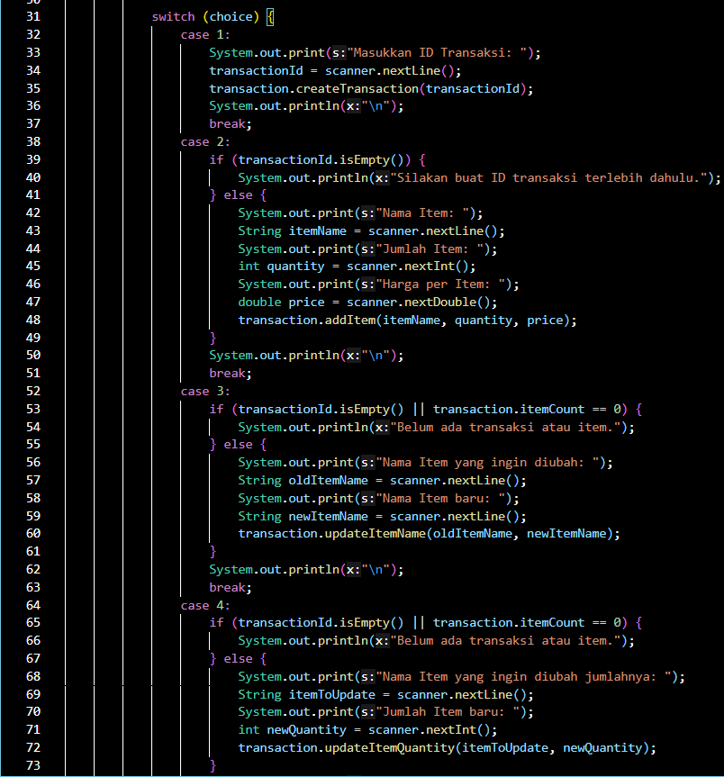

# Laporan Praktikum Kuis 1
Nama    : Aldamaita Salwa Salsabila
Kelas   : SIB 2B
NIM     : 2241760050

## Flowchart

## Penjelasan Alur Kerja Program
PADA CLASS TRANSACTION

- Kode pertama mendeklarasikan beberapa variabel anggota (instance variables) yang bersifat private, yang berarti hanya dapat diakses dari dalam kelas Transaction. Variabel anggota ini adalah:
  - transactionId: Menyimpan ID transaksi.
  - items: Sebuah array String yang digunakan untuk menyimpan nama-nama item dalam transaksi.
  - quantities: Sebuah array int yang digunakan untuk menyimpan jumlah item dalam transaksi.
  - prices: Sebuah array double yang digunakan untuk menyimpan harga per item dalam transaksi.
  - itemCount: Sebuah variabel int yang digunakan untuk melacak jumlah item dalam transaksi.
- Pada konstruktor Transaction();
  - konstruktor kelas Transaction yang akan dijalankan ketika objek transaksi baru dibuat.
  - Dalam konstruktor ini, variabel transactionId diinisialisasi sebagai string kosong (""), dan array items, quantities, dan prices diinisialisasi dengan kapasitas maksimum 100.
  - itemCount diatur ke 0 karena saat inisialisasi, belum ada item dalam transaksi.

- createTransaction(String transactionId):

    Metode ini digunakan untuk membuat atau mengatur ID transaksi. Ketika metode ini dipanggil, nilai dari parameter transactionId akan digunakan untuk menggantikan nilai transactionId yang ada di objek transaksi saat ini.

- addItem(String itemName, int quantity, double price):

    Metode ini digunakan untuk menambahkan item baru ke dalam transaksi.
    Ketika metode ini dipanggil, informasi tentang item baru, seperti nama item (itemName), jumlah item (quantity), dan harga per item (price), akan dimasukkan ke dalam array yang sesuai (items, quantities, dan prices) di indeks itemCount.
    itemCount akan ditingkatkan untuk menandakan bahwa ada satu item tambahan dalam transaksi.

- updateItemName(String oldItemName, String newItemName):
    Ini adalah metode yang digunakan untuk mengubah nama item dalam transaksi.
    Metode ini melakukan perulangan menggunakan loop for untuk iterasi melalui semua item dalam transaksi. Variabel i digunakan sebagai indeks untuk mengakses item dalam array.
    Di setiap iterasi, metode ini memeriksa apakah items[i] (nama item dalam transaksi pada indeks ke-i) sama dengan oldItemName (nama item yang ingin diubah).
    Jika kondisi if terpenuhi, maka items[i] akan diubah menjadi newItemName, sehingga mengganti nama item yang telah ada.

- updateItemQuantity(String itemName, int newQuantity):
    Metode ini digunakan untuk mengubah jumlah item dalam transaksi.
    Metode ini juga menggunakan loop for untuk iterasi melalui semua item dalam transaksi.
    Dalam setiap iterasi, metode ini memeriksa apakah items[i] (nama item dalam transaksi pada indeks ke-i) sama dengan itemName (nama item yang ingin diubah jumlahnya).
    Jika item dengan nama yang sesuai ditemukan, maka quantities[i] (jumlah item dalam transaksi pada indeks ke-i) akan diubah menjadi newQuantity, sehingga mengganti jumlah item yang telah ada.

- updateItemPrice(String itemName, double newPrice):
    Metode ini digunakan untuk mengubah harga per item dalam transaksi.
    Metode ini juga menggunakan loop for untuk iterasi melalui semua item dalam transaksi.
    Dalam setiap iterasi, metode ini memeriksa apakah items[i] (nama item dalam transaksi pada indeks ke-i) sama dengan itemName (nama item yang ingin diubah harganya).
    Jika item dengan nama yang sesuai ditemukan, maka prices[i] (harga per item dalam transaksi pada indeks ke-i) akan diubah menjadi newPrice, sehingga mengganti harga item yang telah ada.

- deleteItem(String itemName)
    
    - Dalam metode deleteItem, terdapat for loop pertama yang digunakan untuk melakukan iterasi melalui semua item dalam transaksi.
    Variabel i digunakan sebagai indeks untuk mengakses item dalam array items, quantities, dan prices.
    - Dalam setiap iterasi, terdapat sebuah kondisi if yang memeriksa apakah items[i] (nama item dalam transaksi pada indeks ke-i) sama dengan itemName (nama item yang ingin dihapus).
    - Jika kondisi ini terpenuhi, maka langkah-langkah berikutnya akan dijalankan. Setelah kondisi if terpenuhi, metode akan memasuki for loop kedua (nested loop).
    - For loop kedua ini digunakan untuk menggeser elemen-elemen setelah item yang akan dihapus.
    - Variabel j digunakan sebagai indeks untuk mengakses elemen-elemen yang perlu digeser.
    - Dalam setiap iterasi for loop kedua, elemen-elemen seperti items[j], quantities[j], dan prices[j] akan diubah nilainya menjadi elemen yang berada satu posisi di depan, yaitu items[j + 1], quantities[j + 1], dan prices[j + 1].
    - Setelah semua elemen yang perlu digeser telah digeser, itemCount dikurangi satu untuk mencerminkan bahwa satu item telah dihapus dari transaksi.
    - Setelah item pertama dengan nama yang sesuai ditemukan dan dihapus, sebuah break statement digunakan untuk menghentikan loop. Ini dilakukan karena tidak perlu mencari item dengan nama yang sama lagi setelah item pertama ditemukan dan dihapus.

- resetTransaction()
    Metode ini digunakan untuk mengatur ulang transaksi dengan menghapus semua item dalam transaksi dan mengatur itemCount kembali menjadi 0.
    Ketika metode ini dipanggil, itemCount diatur menjadi 0, sehingga semua item dalam transaksi dianggap telah dihapus.

- checkOrder()
    - Dalam metode checkOrder, terdapat for loop yang digunakan untuk melakukan iterasi melalui semua item dalam transaksi.
    Variabel i digunakan sebagai indeks untuk mengakses item dalam array items, quantities, dan prices.
    - Dalam setiap iterasi, terdapat kondisi if yang memeriksa tiga kondisi: Apakah items[i] (nama item dalam transaksi pada indeks ke-i) kosong (empty)? Apakah quantities[i] (jumlah item dalam transaksi pada indeks ke-i) kurang dari atau sama dengan 0? Apakah prices[i] (harga per item dalam transaksi pada indeks ke-i) kurang dari atau sama dengan 0?
    - Jika salah satu dari ketiga kondisi ini terpenuhi, variabel inputError akan diatur menjadi true untuk menunjukkan bahwa ada kesalahan dalam input data.
    - Setelah loop selesai, metode memeriksa nilai inputError. Jika inputError adalah true, maka pesan "Terdapat kesalahan input data." akan dicetak. Jika tidak ada kesalahan dalam input data, maka pesan "Pemesanan sudah benar." akan dicetak.

- printReceipt()
    - System.out.println("ID Transaksi: " + transactionId); metode ini mencetak ID Transaksi yang telah diatur sebelumnya dalam objek transaksi.
    System.out.println("| No | Nama Item | Jumlah Item | Harga/Item | Total Harga |");
    System.out.println("---------------------------------------------------------"); 
    Metode ini mencetak header tabel yang berisi judul kolom-kolom seperti "No", "Nama Item", "Jumlah Item", "Harga/Item", dan "Total Harga".
    terdapat sebuah loop for yang digunakan untuk melakukan iterasi melalui semua item dalam transaksi. Ini adalah bagian penting dari metode untuk mencetak informasi setiap item dalam tanda terima.
    - Dalam loop ini, variabel i digunakan sebagai indeks untuk mengakses item dalam array items, quantities, dan prices.
    - Di setiap iterasi, informasi mengenai item (nomor item, nama item, jumlah item, harga per item, dan total harga) dicetak sesuai dengan format yang telah ditentukan. Informasi ini diambil dari array items, quantities, dan prices pada indeks i.
    - Total belanja juga dihitung dengan menambahkan jumlah item (quantities) dikali harga per item (prices) pada setiap iterasi.
    - Setelah garis pemisah tabel, metode ini mencetak total belanja yang dihitung sebelumnya.
    - Setelah itu, melakukan perhitungan diskon berdasarkan total belanja. Ini dilakukan dengan beberapa kondisi if. membuat variabel diskon dan menginisialisasinya dengan nilai awal 0.
    - Kemudian, ada beberapa kondisi if berturut-turut yang memeriksa total belanja:
    - Jika total belanja lebih besar dari 500,000, maka diskon sebesar 10% dari total belanja.
    - Jika total belanja lebih besar dari 300,000 (tetapi kurang dari atau sama dengan 500,000), maka diskon    sebesar 8% dari total belanja.
    - Jika total belanja lebih besar dari 200,000 (tetapi kurang dari atau sama dengan 300,000), maka diskon sebesar 5% dari total belanja. Setelah perhitungan diskon selesai, metode ini menggunakan beberapa kondisi if untuk mencetak informasi diskon dan total pembayaran sesuai dengan situasi. Jika ada diskon yang diberikan (yaitu jika nilai diskon lebih besar dari 0), maka metode akan mencetak informasi diskon dan total pembayaran setelah diskon. Total pembayaran setelah diskon dihitung dengan mengurangkan diskon dari total belanja.
    - Jika tidak ada diskon yang diberikan (yaitu jika nilai diskon adalah 0), metode akan mencetak bahwa tidak ada diskon yang diberikan berserta total pembayaran tanpa diskon.

PADA MAIN

- mengimpor java.util.Scanner untuk memungkinkan input dari pengguna melalui terminal.
- Objek Transaction dan Scanner dideklarasikan untuk digunakan dalam program.
Transaction transaction = new Transaction(); menginisialisasi objek Transaction yang akan digunakan untuk mengelola transaksi. Scanner scanner = new Scanner(System.in); menginisialisasi objek Scanner yang akan digunakan untuk menerima input dari pengguna.
- Loop dimulai dengan kata kunci do, yang berarti perintah-perintah dalam blok akan dijalankan sekurang-kurangnya satu kali sebelum kondisi di pernyataan while diperiksa. Di dalam loop, program menampilkan menu kepada pengguna dan meminta pengguna untuk memasukkan pilihan mereka. Pilihan pengguna disimpan dalam variabel choice.
scanner.nextInt(); digunakan untuk membaca angka yang dimasukkan oleh pengguna, dan scanner.nextLine(); digunakan untuk membersihkan karakter newline (\n) yang tersisa setelah memasukkan angka.
- Setelah pilihan pengguna diterima, program akan menjalankan tindakan yang sesuai berdasarkan pilihan tersebut. Namun, implementasi rinci dari operasi-operasi ini tidak terlihat dalam potongan kode yang diberikan. Operasi-operasi ini akan diimplementasikan dalam bagian program yang lebih lanjut, sesuai dengan pilihan pengguna.
- Loop do-while akan terus berjalan selama kondisi dalam pernyataan while adalah true. Dalam hal ini, kondisi adalah choice != 0, yang berarti loop akan terus berjalan selama pengguna tidak memilih untuk keluar (pilihan 0).
Jika pengguna memilih 0 (Keluar), maka kondisi choice != 0 akan menjadi false, dan loop akan berhenti. Ini akan mengakhiri program.

- switch, akan memeriksa nilai choice (pilihan pengguna) dan akan menjalankan blok kode yang sesuai dengan kasus (case) yang cocok dengan nilai choice. Berikut ini adalah implementasi untuk masing-masing pilihan:
    - case 1, Jika pengguna memilih 1, program akan meminta pengguna untuk memasukkan ID Transaksi dan menyimpannya menggunakan transaction.createTransaction(transactionId).
    Sebelumnya, program akan memeriksa apakah ID Transaksi sudah ada atau belum.
    Setelah berhasil, program akan memberikan pesan "ID Transaksi berhasil dibuat" dan meminta pengguna untuk memilih menu berikutnya.
    - case 2, Jika pengguna memilih 2, program akan memeriksa apakah ID Transaksi sudah dibuat dan bukan kosong (transactionId tidak kosong).
    Jika ya, program akan meminta pengguna memasukkan nama item, jumlah item, dan harga per item.
    Data item ini akan ditambahkan ke dalam objek transaksi menggunakan transaction.addItem(itemName, quantity, price).
    - case 3, Jika pengguna memilih 3, program akan memeriksa apakah ID Transaksi sudah dibuat dan jika ada item dalam transaksi (transaction.itemCount tidak 0).
    Jika ya, program akan meminta pengguna untuk memasukkan nama item yang ingin diubah dan nama baru untuk item tersebut.
    Nama item akan diperbarui menggunakan transaction.updateItemName(oldItemName, newItemName).
    - case 4, Jika pengguna memilih 4, program akan memeriksa apakah ID Transaksi sudah dibuat dan jika ada item dalam transaksi.
    Jika ya, program akan meminta pengguna untuk memasukkan nama item yang ingin diubah jumlahnya dan jumlah baru untuk item tersebut.
    Jumlah item akan diperbarui menggunakan transaction.updateItemQuantity(itemToUpdate, newQuantity).

- case 5, Jika pengguna memilih 5, program akan memeriksa apakah ID Transaksi sudah dibuat dan jika ada item dalam transaksi. Jika ya, program akan meminta pengguna untuk memasukkan nama item yang ingin diubah harganya dan harga baru untuk item tersebut. Harga item akan diperbarui menggunakan transaction.updateItemPrice(itemToChangePrice, newPrice).
- case 6, Jika pengguna memilih 6, program akan memeriksa apakah ID Transaksi sudah dibuat dan jika ada item dalam transaksi. Jika ya, program akan meminta pengguna untuk memasukkan nama item yang ingin dihapus.
Item tersebut akan dihapus dari transaksi menggunakan transaction.deleteItem(itemToDelete).
- case 7, Jika pengguna memilih 7, program akan memeriksa apakah ID Transaksi sudah dibuat dan jika ada item dalam transaksi.Jika ya, transaksi akan direset sehingga tidak ada item dalamnya menggunakan transaction.resetTransaction().
- case 8, Jika pengguna memilih 8, program akan memeriksa apakah ID Transaksi sudah dibuat dan jika ada item dalam transaksi. Jika ya, program akan memeriksa apakah semua data item sudah diisi dengan benar menggunakan transaction.checkOrder().
- case 9, Jika pengguna memilih 9, program akan memeriksa apakah ID Transaksi sudah dibuat dan jika ada item dalam transaksi. Jika ya, program akan mencetak tanda terima (receipt) transaksi menggunakan transaction.printReceipt().
- case 0, Jika pengguna memilih 0, program akan keluar dari loop do-while dan menampilkan pesan "Terima kasih!".
- Default Case, Jika pengguna memasukkan pilihan selain dari 0 hingga 9, program akan menjalankan blok default dan menampilkan pesan "Pilihan tidak valid."
- Di setiap case, program melakukan pemeriksaan apakah ID Transaksi sudah dibuat (transactionId tidak kosong) dan apakah ada item dalam transaksi (transaction.itemCount tidak 0). Jika kondisi ini tidak terpenuhi, program akan menampilkan pesan yang sesuai. Setelah setiap case selesai dijalankan, program akan menampilkan pesan "Selesai" dan kembali ke menu utama. Loop do-while akan terus berjalan hingga pengguna memilih untuk keluar (pilihan 0).

## Penjelasan Alur Kerja Output

Penjelasan :

1. Customer memasukkan ID Transaksi terlebih dahulu, jika sudah membuat nantinya akan munucl kembali  bagian MENU. Akan tetapi,  tidak memasukkan ID transaksi terlebih dahulu nanti akan muncul pernyataan "Silakan buat ID transaksi terlebih dahulu", lalu muncul kembali bagian menu.
2. Customer telah membuat ID Transaksi (seperti dalam Skenario 1) dan memilih untuk menambah item (pilihan "2"). Program akan meminta pengguna untuk memasukkan detail item. Program akan menambahkan item, dengan jumlah, dan harganya ke dalam transaksi.
3. Customer dapat melanjutkan dengan memilih opsi menu lain atau menyelesaikan transaksi untuk mencetak tanda terima. jika ingin mnegupdate nama item bisa memilih menu 3. yang nantinya Customer akan disuruh mengisi nama item nama yang ingin diganti, lalu akan muncul nama item baru dan bisa diisi nama item yang baru.
4. Setelah itu, Customer bisa memilih lagi menu, jika ingin mengupdate jumlah barang bisa memilih mneu nomor 4. nanrinya cutomer akan disuruh untuk mengisi nama item mana yang ingin diganti jumlahnya. lalu akan diperintahkan kembali mnegisi jumlah barang yang baru.
5. Setelah itu, customer bisa memilih kembali menu apa yang diinginkan, jika ingin mnegganti harga item bisa memilih menu 5. nantinya akan diperintahkan untuk mengisi nama item mana yang harganya akan diganti, setelah itu mengisi harga barunya.
6. Selanjutnya, jika ingin menghapus item, bisa memilih menu nomer 6. nantinya Customer diminta untuk mengisi nama item mana yang ingin dihapus.
7. Selanjutnya, jika ingin mereset semua transaksi, bisa memilih menu nomor 7
8. Selanjutnya, jika ingin mengecheck apakah order se memilih nomor 9. usai atau belum bisa memilih nomor 8. Jika sesuai nantinya akan muncul pernyataan "Orderan anda seusai" , akan teteapi jika belum akan muncul pernyataan "Beluma ada transaksi atau item".
9. Selanjutnya, jika ingin mencetak seluruh pembelian memilih nomor 9. nantinya akan muncul tabel seluruh item, harga barang, dan jumlah barang.
10. Selanjutnya, jika ingin keluar bisa memilih nomor 0. nanti akan mencetak "Terima kasih!"

### Bukti 
