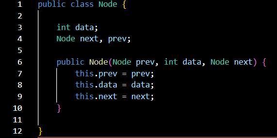
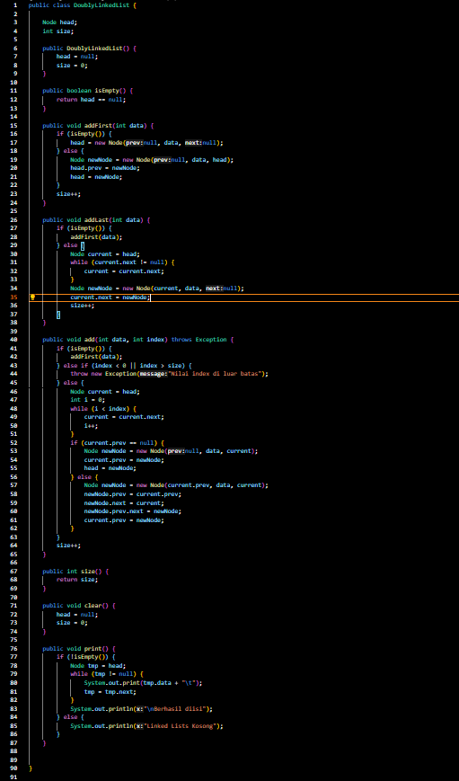
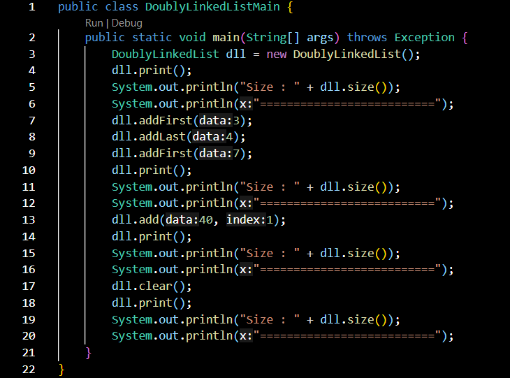
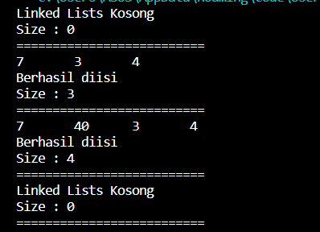
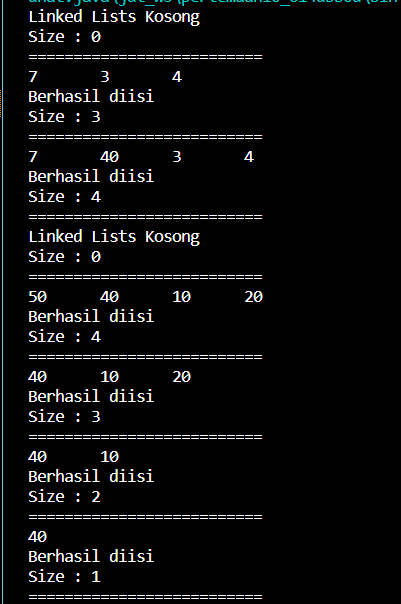
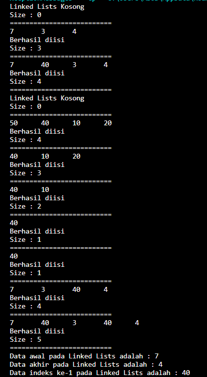

# Laporan Praktikum Pertemuan 10

Nama    : Aldamiata Salwa Salsabila

Kelas   : SIB 2B

NIM     : 2241760050

## Program dan Output Praktikum 1

### Pertanyaan Praktikum 1

1. Jelaskan perbedaan antara single linked list dengan doubly linked lists!

Jawab:

Perbedaan dari keduanya, yaitu Single linked list lebih sederhana dan lebih hemat memori, akan tetapi hanya dapat ditelusuri dalam satu arah. Sedangkan, Doubly linked list lebih kompleks dan lebih boros memori, akan tetapi dapat ditelusuri dalam dua arah.

2. Perhatikan class Node, di dalamnya terdapat atribut next dan prev. Untuk apakah atribut
tersebut?

Jawab:

Atribut prev digunakan untuk menyimpan pointer ke node berikutnya dan node sebelumnya. Pointer ini digunakan untuk menghubungkan node-node dalam doubly linked list.

3. Perhatikan konstruktor pada class DoublyLinkedList. Apa kegunaan inisialisasi atribut head dan size?

Jawab:

Untuk memastikan bahwa doubly linked list dalam keadaan kosong ketika pertama kali dibuat. Pada atribut head diinisialisasi dengan nilai null,artinya bahwa tidak ada node dalam doubly linked list. Lalu, atribut size diinisialisasi dengan nilai 0, artinya bahwa jumlah node dalam doubly linked list adalah nol. Untuk memudahkan operasi-operasi pada doubly linked list. Inisialisasi atribut head dan size memudahkan untuk melakukan operasi-operasi seperti menambahkan node baru, menghapus node, dan mencari node dalam doubly linked list.

4. Pada method addFirst(), mengapa dalam pembuatan objek dari konstruktor class Node prev dianggap sama dengan null?

head = new Node(null, data, null);

Jawab:

Karena pada node yang baru dibuat akan menjadi node pertama dalam doubly linked list. Node pertama dalam doubly linked list tidak memiliki node sebelumnya, sehingga prev harus diinisialisasi dengan nilai null.

5. Perhatikan pada method addFirst(). Apakah arti statement head.prev = newNode?

Jawab:

Pada pointer prev dari node head akan diubah untuk menunjuk ke node newNode. Hal ini dilakukan untuk menghubungkan node head dengan node newNode.

6. Perhatikan isi method addLast(), apa arti dari pembuatan objek Node dengan mengisikan parameter prev dengan current, dan next dengan null?

Node newNode = new Node(current, data, null);

Jawab:

Pada method addLast() terdapat prev, current, dan next. Prev merupakan pointer ke node sebelumnya, Current merupakan pointer ke node terakhir dalam doubly linked list, sedangkan next merupakan pointer ke node berikutnya.

7. Pada method add(), terdapat potongan kode program sebagai berikut,

if (current.prev == null) {
    Node newNode = new Node(null, data, current);
    current.prev = newNode;
    head = newNode;
}

Jawab:

Potongan program tersebut menjelaskan, bahwa:

> kode memeriksa apakah current.prev (yaitu node sebelumnya dari current) adalah null. Ini menunjukkan bahwa kita berada pada node pertama dalam linked list, atau dalam kata lain, kita akan menambahkan elemen baru di posisi pertama linked list.Jika kondisi tersebut terpenuhi (artinya kita ingin menambahkan elemen di posisi pertama linked list), maka kode tersebut membuat sebuah Node baru dengan nilai data dan next yang menunjuk ke current (node pertama sebelum penambahan). prev dari node baru diatur sebagai null, karena ini adalah node pertama dalam linked list.

> Selanjutnya, current.prev diatur untuk menunjuk ke node baru, sehingga current.prev sekarang adalah node pertama dalam linked list yang baru, yang diwakili oleh head. Akhirnya, head diatur untuk menunjuk ke node baru, yang sekarang menjadi node pertama dalam linked list yang telah diperbarui.

Jadi kode tersebut bertujuan untuk menambahkan elemen baru di posisi pertama linked list dan memperbarui head agar menunjuk ke node baru ini, menjadikannya elemen pertama dalam linked list yang baru.

## Program dan Output Praktikum 2

### Pertanyaan Praktikum 2

1. Apakah maksud statement berikut pada method removeFirst()?

head = head.next;
head.prev = null;

Jawab :

Pada Statement (head = head.next;) yang berada di dalam method removeFirst() digunakan untuk menghapus node pertama pada linked list. Hal ini dilakukan dengan menggeser pointer head ke node berikutnya. Untuk Statement (head.prev = null;) digunakan untuk menghapus link ke node sebelumnya dan untuk memastikan bahwa node pertama yang dihapus tidak lagi menjadi bagian dari linked list.

2. Bagaimana cara mendeteksi posisi data ada pada bagian akhir pada method removeLast()?

Jawab :

Caranya, yaitu saat posisi data ada pada bagian akhir dideteksi dengan menggunakan kondisi current.next.next == null. Maka, Kondisi ini akan bernilai true jika node current adalah node terakhir pada linked list.Apabila, linked list memiliki lebih dari satu node, maka posisi data ada pada bagian akhir dapat dideteksi dengan menggunakan loop while. Loop ini akan berjalan hingga pointer current menunjuk ke node terakhir.

3. Jelaskan alasan mengapa potongan kode program di bawah ini tidak cocok untuk perintah remove!

Node tmp = head.next;
head.next = tmp.next;
tmp.next.prev = head;

Jawab :

Potongan kode program di atas tidak cocok untuk perintah remove hal ini dikarenakan program tidak menghapus node yang diinginkan. Program ini hanya menggeser node berikutnya ke posisi node yang diinginkan.

4. Jelaskan fungsi kode program berikut ini pada fungsi remove!

current.prev.next = current.next;
current.next.prev = current.prev;

Jawab :

Pada statement (current.prev.next = current.next), digunakan untuk menghubungkan node sebelumnya dari node current ke node berikutnya dari node current.Lalu, untuk statement (current.next.prev = current.prev) digunakan untuk menghubungkan node berikutnya dari node current ke node sebelumnya dari node current.

## Program dan Output Praktikum 3

### Pertanyaan Praktikum 3

1. Jelaskan method size() pada class DoublyLinkedList!

Jawab :

Method size() pada class DoublyLinkedList digunakan untuk mengembalikan ukuran dari DoublyLinkedList tersebut. Ukuran dari DoublyLinkedList adalah jumlah node yang ada pada DoublyLinkedList tersebut.

2. Jelaskan cara mengatur indeks pada doubly linked lists supaya dapat dimulai dari indeks ke-1!

Jawab :

pertama, buat sebuah node dummy baru.
kedua, atur pointer prev dari node dummy menjadi null.
ketiga, atur pointer next dari node dummy menjadi head dari doubly linked list.
keempat, atur pointer prev dari head dari doubly linked list menjadi node dummy.
kelima, atur head dari doubly linked list menjadi node dummy.

3. Jelaskan perbedaan karakteristik fungsi Add pada doubly linked list dan single linked list!

Jawab :

Doubly Linked List:

1. Memiliki dua pointer pada setiap nodenya, yaitu pointer yang mengarah ke node sebelumnya (prev) dan pointer yang mengarah ke node berikutnya (next).
2. Dalam doubly linked list, mudah mengakses node sebelum node yang sedang dioperasikan, karena setiap node memiliki referensi ke node sebelumnya. 3. Dapat menambahkan elemen di antara dua node yang sudah ada dengan mudah, karena sebelumnya sudah memiliki akses ke node dan node berikutnya.

Single Linked List:

1. Hanya memiliki satu pointer yang mengarah ke node berikutnya (next) pada setiap nodenya, berarti Single Linked List tidak memiliki referensi langsung ke node sebelumnya.
2. Tidak memiliki referensi langsung ke node sebelumnya. Untuk mengakses node sebelumnya, diperlukan mengiterasi dari awal linked list hingga mencapai node yang diinginkan.
3. Dapat Menambahkan elemen di posisi tengah pada single linked list memerlukan iterasi melalui linked list hingga mencapai posisi yang diinginkan, yang memerlukan lebih banyak waktu daripada pada doubly linked list.

4. Jelaskan perbedaan logika dari kedua kode program di bawah ini!

Kode 1
public boolean isEmpty() {
    if(size==0) {
        return true;
    } else {
        return false;
    }
}

Kode 2
public boolean isEmpty() {
    return head == null;
}

Jawab :

Kode 1 
Menggunakan pernyataan kondisional if untuk memeriksa apakah size sama dengan 0. Jika size sama dengan 0, maka mengembalikan true, yang menunjukkan bahwa struktur data kosong. Jika size tidak sama dengan 0, maka mengembalikan false, yang menunjukkan bahwa struktur data tidak kosong. Ini adalah pendekatan yang valid, tetapi ada sedikit "kelebihan beban" dalam penggunaan kondisional, karena sebenarnya dapat mengembalikan hasil perbandingan langsung.

Kode 2 
Menggunakan perbandingan langsung head == null untuk memeriksa apakah head (node pertama dalam linked list) adalah null. Jika head adalah null, maka mengembalikan true, yang menunjukkan bahwa struktur data kosong. Jika head tidak null, maka mengembalikan false, yang menunjukkan bahwa struktur data tidak kosong.

## Tugas 1

Buat program antrian vaksinasi menggunakan queue berbasis doubly linked list sesuai ilustrasi dan menu di bawah ini! (counter jumlah antrian tersisa di menu cetak(3) dan data orang yang telah divaksinasi di menu Hapus Data(2) harus ada)

Jawab :

## Tugas 2

Buatlah program daftar film yang terdiri dari id, judul dan rating menggunakan doubly linked lists, bentuk program memiliki fitur pencarian melalui ID Film dan pengurutan Rating secara descending. Class Film wajib diimplementasikan dalam soal ini.

Jawab :

