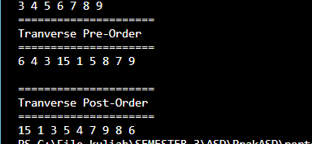

# Laporan Praktikum Pertemuan 11

Nama    : Aldamiata Salwa Salsabila

Kelas   : SIB 2B

NIM     : 2241760050

## Program dan Output Praktikum 1

### Pertanyaan Praktikum 1
1. Mengapa dalam binary search tree proses pencarian data bisa lebih efektif dilakukan dibanding binary tree biasa?

Jawab :

Karena pada binary search tree (BST) memiliki struktur yang lebih teratur dan terorganisir dibandingkan dengan binary tree biasa. Pada BST, setiap simpul juga memiliki nilai kunci yang membedakan dengan nilai kunci dari simpul lainnya. Adanya urutan kunci ini memungkinkan proses pencarian data menjadi lebih efektif, karena dapat mengeliminasi sebagian besar cabang yang tidak perlu dicek.

2. Apa fungsi atribut left dan right pada class Node?

Jawab :

Pada Atribut left berfungsi menunjukkan anak sisi kiri pohon. Sedangkan, pada Atribut right berfungsi menunjukkan anak sisi kanan pohon.

3. Simak pertanyaan berikut,
    
    1. Apa kegunaan dari atribut root di dalam class BinaryTree?
    2. Ketika objek tree pertama kali dibuat, apa nilai dari root?

Jawab :

    1. Atribut "root" dalam class BinaryTree digunakan untuk menyimpan referensi ke simpul akar (root) dari pohon biner. Simpul akar adalah simpul paling atas dalam struktur pohon dan merupakan titik awal untuk mengakses seluruh pohon.

    2. Nilai dari root saat objek tree pertama kali dibuat yaitu null atau kosong pada program terlihat (root == null)

4. Ketika tree masih kosong, dan akan ditambahkan sebuah node baru proses apa yang akan terjadi?

Jawab :

Node baru yang ditambahkan akan menjadi simpul paling atas dan data yang disimpan dengan titik kiri dan kanan ke nol.

5. Perhatikan method add(), di dalamnya terdapat baris program seperti di bawah ini. Jelaskan secara detil untuk apa baris program tersebut?

if(data < current.data) {
    if(current.left != null) {
        current = current.left;
    } else {
        current.left = new Node(data);
        break;
    }
}

Jawab :

Pada program di atas digunakan untuk  melakukan traverse yang digunakan untuk mengakses setiap node yang disimpan sehingga data tersebut dapat diperiksa atau digunakan. Yang pertama, jika data kurang atau lebih rendah dari current.data, jika kondisinya true maka dicek lagi, jika current.left != null maka current akan ganti menjadi current.left. Jika kondisinya false maka current akan diisi dengan newNode dan proses akan berhenti

## Program dan Output Praktikum 2

### Pertanyaan Praktikum 2
1. Apakah kegunaan dari atribut data dan idxLast yang ada di class BinaryTreeArray?

Jawab :

- data[] digunakan untuk menyimpan data array
- idxLast digunakan untuk mengatur index terakhir dari data data yang akan disimpan atau dipanggil

2. Apakah kegunaan dari method populateData()?

Jawab :

Kegunaan dari method populateData() adalah digunakan untuk memanggil dan mengembalikan data dari data[] sampai idxLast

3. Apakah kegunaan dari method traverseInOrder()?

Jawab :

Kegunaan dari method traverseInOrder() adalah digunakan untuk melintasi data pohon di traverseInOrder (cetak-kiri-kanan), yang mengunjungi data dan mencetak data root. Lalu mengunjungi secara rekursif dan mencetak semua data di subpohon kiri mulai dari anak kiri, dan kemudian secara rekursif mengunjungi dan mencetak semua data di subpohon kanan mulai dari anak kanan.

4. Jika suatu node binary tree disimpan dalam array indeks 2, maka di indeks berapakah posisi left child dan rigth child masin-masing?

Jawab :

- Dengan asumsi root dimulai dari indeks-0
- Anak kiri dari simpul i berada pada indeks : 2*i+1 = 2*2+1 = 5
- Anak kanan dari simpul i berada pada indeks : 2*i+2 = 2*2+2 = 6
- Dengan asumsi root dimulai dari indeks-1
- Anak kiri simpul i berada pada indeks : 2*i = 2*2 = 4
- Anak kanan dari simpul i berada pada indeks : 2*i+1 = 2*2+1 = 5

5. Apa kegunaan statement int idxLast = 6 pada praktikum 2 percobaan nomor 4?

Jawab :

Deklarasikan statement int idxLast = 6 pada praktikum 2 percobaan nomor 4 dan mengatur nilai idxLast adalah 6. Yang artinya data maksimal itu yang akan digunakan dan dipanggil hanya 6 data. Dalam percobaan itu, data [] adalah {6,4,8,3,5,7,9,0,0,0}, ada 10 data mulai dari indeks-0 sampai indeks-9, tetapi karena nilai idxLast adalah 6 maka data yang akan dipanggil hanya dari index-0 sampai index-5 yaitu {6,4,8,3,5,7,9}.

## Tugas1

## Tugas 2

## Tugas 3

## Tugas 4

## Tugas 5

