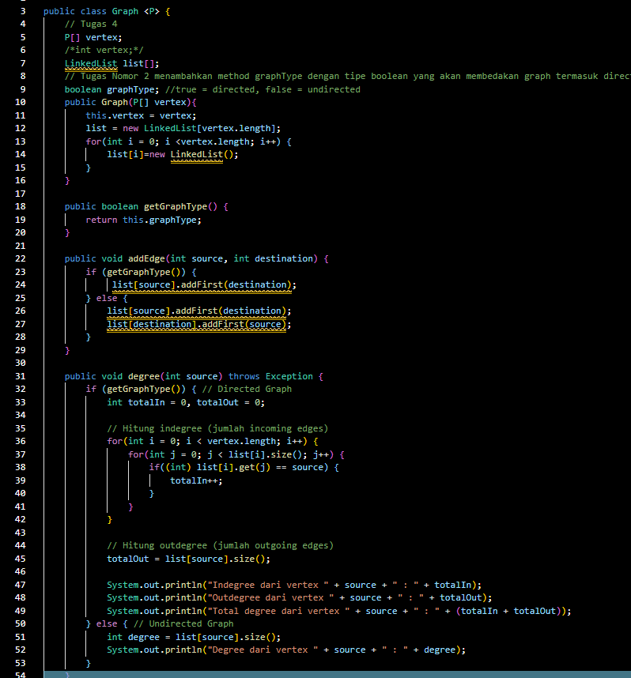
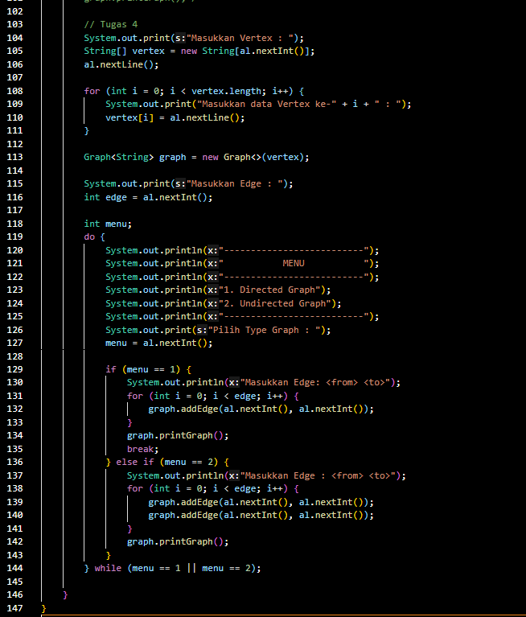

# Laporan Praktikum Pertemuan 11

Nama    : Aldamiata Salwa Salsabila

Kelas   : SIB 2B

NIM     : 2241760050

## Program dan Output Praktikum 1

### Pertanyaan Praktikum 1
1. Sebutkan beberapa jenis (minimal 3) algoritma yang menggunakan dasar Graph, dan apakah kegunaan algoritma-algoritma tersebut?

Jawab :

- Algoritma Dijkstra, ini digunakan untuk menemukan jalur terpendek dari suatu titik awal ke semua titik lain dalam graf berbobot.

- Algoritma Breadth-First Search (BFS), ini digunakan untuk menjelajahi atau mencari graf atau pohon secara berjenjang, mengeksplorasi semua tetangga pada tingkat saat ini sebelum beralih ke tingkat berikutnya.

- Algoritma Depth-First Search (DFS), ini digunakan untuk menjelajahi atau mencari graf atau pohon secara mendalam, mengeksplorasi sejauh mungkin di sepanjang setiap cabang sebelum melakukan backtracking.

2. Pada class Graph terdapat array bertipe LinkedList, yaitu LinkedList list[]. Apakah tujuan pembuatan variabel tersebut ? 

Jawab :

Pada implementasi kelas Graph ini, array bertipe LinkedList yang disebut list digunakan untuk merepresentasikan struktur data graf menggunakan representasi adjacency list. Representasi adjacency list adalah salah satu cara untuk menyimpan graf di mana setiap simpul graf memiliki daftar simpul yang terhubung (tetangga) dengannya. List adalah array dari objek LinkedList, di mana setiap elemen array mewakili satu simpul dari graf. Setiap elemen LinkedList dalam array ini menyimpan daftar simpul yang terhubung dengan simpul tersebut.

3. Apakah alasan pemanggilan method addFirst() untuk menambahkan data, bukan method add jenis lain pada linked list ketika digunakan pada method addEdge pada class Graph?

Jawab :

Pemanggilan method addFirst() digunakan pada method addEdge() pada class Graph untuk menambahkan data ke LinkedList yang merepresentasikan graf. Karena method tersebut adalah representasi adjacency list, penambahan vertex baru dihubungkan dengan vertex lain melalui urutan pertama (head) dari linked list tersebut.

4. Bagaimana cara mendeteksi prev pointer pada saat akan melakukan penghapusan suatu edge pada graph ?

Jawab :

Jika ingin menghapus edge pada graph, prev pointer di deteksi terlebuh dahulu dengan menggunakan adjacency list pada graph, misalhnya : Jika kita ingin menghapus edge antara simpul B dan simpul C, kita akan mencari simpul B dalam LinkedList yang terhubung dengan simpul A. 

5. Kenapa pada praktikum 12.2 langkah ke-12 untuk menghapus path yang bukan merupakan lintasan pertama kali menghasilkan output yang salah ? Bagaimana solusinya ?

graph.removeEdge(1,3);
graph.printGraph();

Jawab :
Tidak, hanya saja pada praktikum langkah ke-12 yang dipanggil adalah graph method removeEdge(1, 2); bukan method graph.removeEdge(1, 3); Jadi, kesalahannya pada soal bukan pada output.

## Program dan Output Praktikum 2

### Pertanyaan Praktikum 2
1. Apakah perbedaan degree/derajat pada directed dan undirected graph?

Jawab :

- Undirected graph, adalah graph yang simpulnya hanya menghubungkan 2 vertex tanpa menunjukkan arah.

- Directed graph/digraph, adalah graph yang simpulnya tidak hanya menghubungkan 2 vertex tetapi juga menunjukkan arah.

2. Pada implementasi graph menggunakan adjacency matriks. Kenapa jumlah vertices harus ditambahkan dengan 1 pada indeks array berikut?

public GraphArray(int v) {
        vertices = v;
        twoD_array = new int [vertices + 1] [vertices + 1];
}

Jawab :

Penambahan 1 pada jumlah vertices biasanya terkait dengan pengindeksan array dimulai dari 0, karena seringkali memulai indeks array dari 0. hal ini, untuk merepresentasikan simpul-simpul dalam graph, dan penambahan 1 pada jumlah vertices memungkinkan kita untuk menggunakan indeks array dari 1 hingga jumlah vertices yang diinginkan.

3. Apakah kegunaan method getEdge() ?

Jawab :

Method tersebut ntuk mendapatkan nilai edge antara dua vertex dalam graph yang direpresentasikan menggunakan adjacency matrix. Method ini menggunakan dua parameter yang mewakili index dari vertex tujuan dan vertex asal.

4. Termasuk jenis graph apakah uji coba pada praktikum 12.3 ?

Jawab :

Program pada praktikum 12.3 termasuk jenis graph undirected graph

5. Mengapa pada method main harus menggunakan try-catch Exception ?

Jawab :

Penggunaan Try-Catch Exception digunakan untuk menangkap error yang terjadi, dan menampilkan pesan errornya sehingga penyebab error dapat diketahui.

## Tugas
1. Ubahlah lintasan pada praktikum 12.2 menjadi inputan!

Jawab :

2. Tambahkan method graphType dengan tipe boolean yang akan membedakan graph termasuk directed atau undirected graph. Kemudian update seluruh method yang berelasi dengan method graphType tersebut (hanya menjalankan statement sesuai dengan jenis graph) pada praktikum 12.2

Jawab :

3. Modifikasi method removeEdge() pada praktikum 12.2 agar tidak menghasilkan output yang salah untuk path selain path pertama kali!

Jawab :

4. Ubahlah tipe data vertex pada seluruh graph pada praktikum 12.2 dan 12.3 dari Integer menjadi tipe generic agar dapat menerima semua tipe data dasar Java! Misalnya setiap vertex yang awalnya berupa angka 0,1,2,3, dst. selanjutnya ubah menjadi suatu nama daerah seperti Malang, Surabaya, Gresik, Bandung, dst

Jawab :

----------------------------------
----------------------------------

