# Laporan Praktikum Pertemuan 14

Nama    : Aldamiata Salwa Salsabila

Kelas   : SIB 2B

NIM     : 2241760050

## Program dan Output Praktikum 1
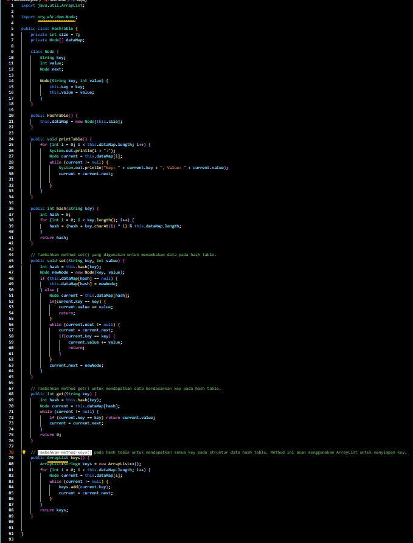
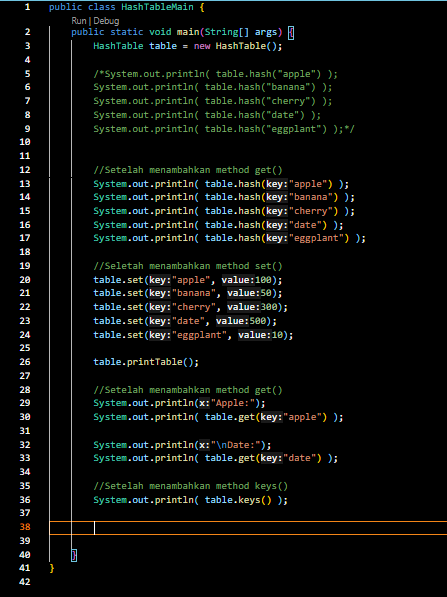
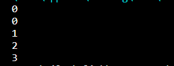
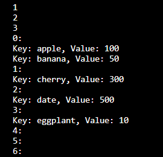
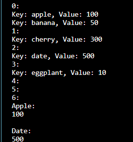
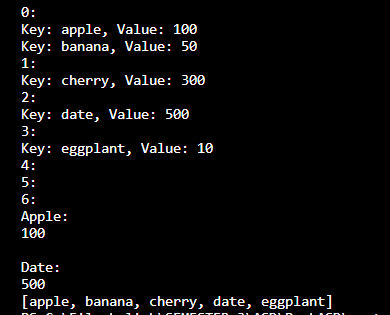

### Pertanyaan Praktikum 1

1. Apa keunggulan penanganan collision menggunakan metode separate chaining dibandingkan dengan motode linear probing?

Jawab :

- implementasi metode separate chaining lebih sederhana dan mudah dipahami
- Separate chaining bisa menangani collision berkali-kali dengan efisien. Sedangkan Linear probing jika mengalami masalah akan menyebabkan munculnya collision tambahan.
- penggunaan ruang Separate chaining lebih fleksibel
- Separate chaining tidak memerlukan penyimpanan tambahan karena memiliki linked list disetiap selnya, sedangkan Linear probing memerlukan penyimpanan tambahan untuk menunjukkan langkah-langkah yang diambil agar dapat menemukan lokasi yang sesuai dalam menyisipkan elemen yang bersinggungan.

2. Apa maksud dari potongan kode berikut pada method hash()?
    int hash = 0;
    for (int i = 0; i < key.length(); i++) {
        hash = (hash + key.charAt(i) * i) % this.dataMap.length;
    }

Jawab :

potongan kode di atas sebagai fungsi hash yang menghasilkan nilai hash untuk sebuah string (key). Setiap key akan diubah menjadi nilai dari hash yang nantinya akan menentukan letak penyimpanannya di dalam tabel hash (this.dataMap)

3. Apa maksud dari potongan kode berikut pada method set()?
    else {
        Node current = this.dataMap[hash];
        if(current.key == key) {
            current.value += value;
            return;
        }
        while (current.next != null) {
            current = current.next;
            if(current.key == key) {
                current.value += value;
                return;
            }
        }
        current.next = newNode;
    }

Jawab :

method ini dipanggil untuk menetapkan nilai (value) untuk suatu kunci (key) di dalam tabel hash, langkah-langkah tertentu dijalankan. program memeriksa apakah terdapat node dengan kunci yang sama pada indeks yang dihasilkan oleh fungsi hash. lalu setiap node dicek untuk memastikan bahwa tidak ada node dengan kunci yang sama. Proses ini memastikan bahwa kunci yang unik dapat disimpan dalam tabel hash, dan jika kunci tersebut sudah ada, nilai yang sesuai dapat diperbarui tanpa menambahkan duplikat node baru.

## Program dan Output Tugas

Implementasikan kasus berikut dengan menggunakan hash table.

- Buatlah objek Mahasiswa dengan atribut sebagai berikut,
    - NIM
    - Nama Lengkap
    - Jurusan
    - Program Studi
- Buatlah kelas HashTable yang dapat menyimpan objek Mahasiswa dengan spesifikasi,
    - Key --> NIM mahasiswa
    - Value --> Objek Mahasiswa
    - Dapat menambahkan data mahasiswa dengan menggunakan inputan.
    - Dapat mencari mahasiswa berdasarkan NIM.
    - Dapat menghapus mahasiswa.
    - Dapat menampilkan seluruh NIM mahasiswa yang telah tersimpan. 

Jawab :

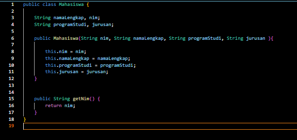
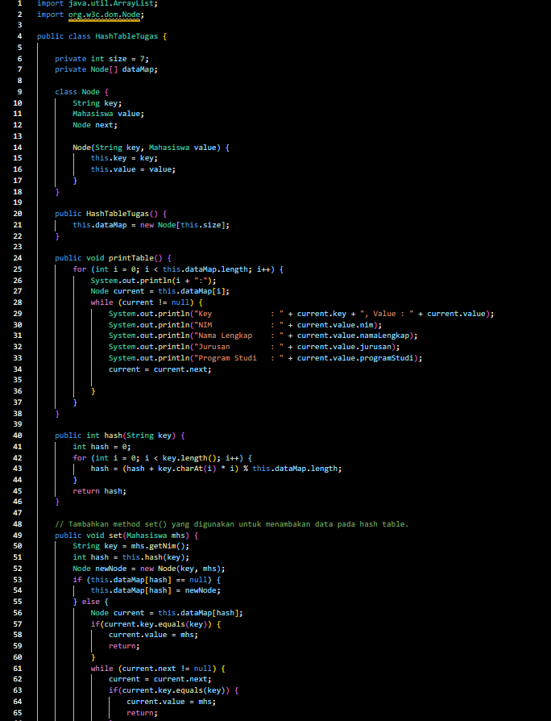
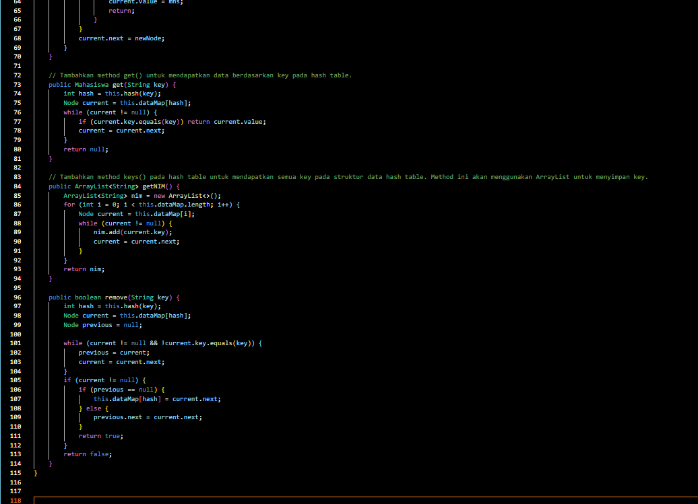
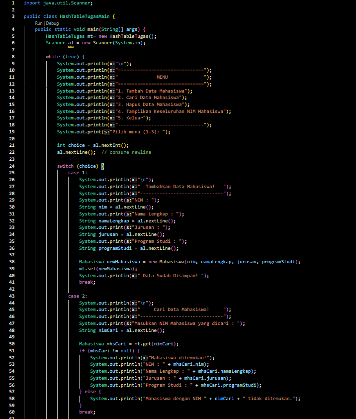
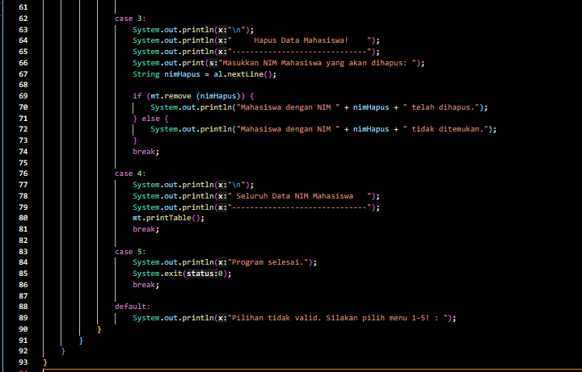
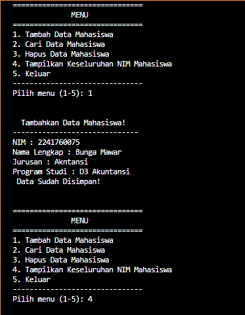
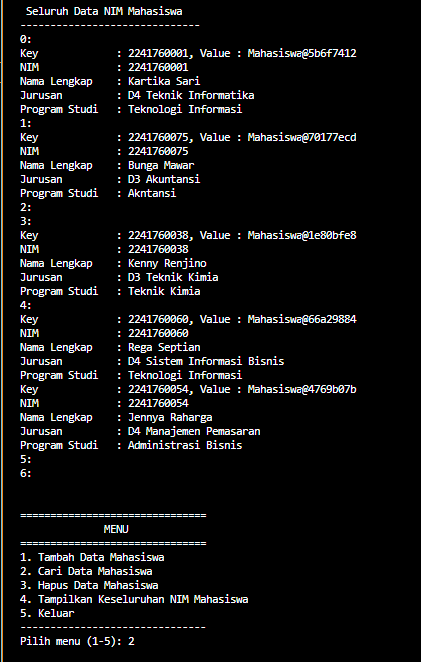
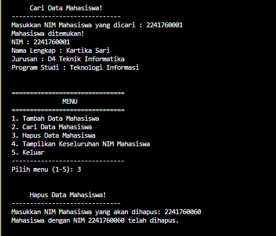
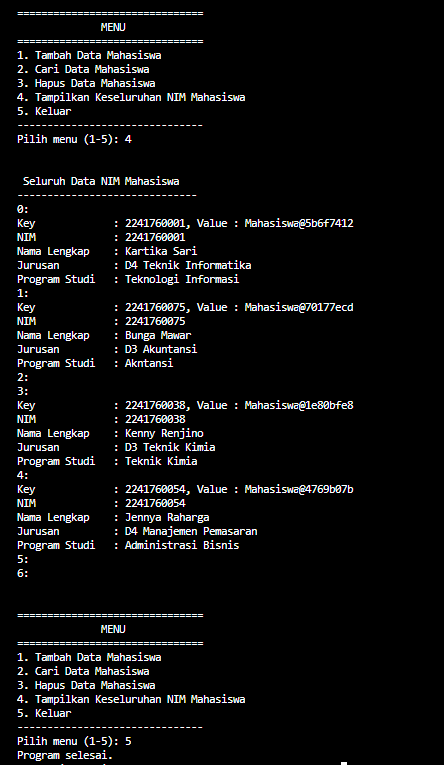
