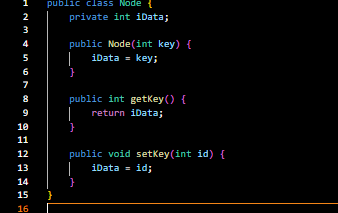

# Laporan Praktikum Pertemuan 14

Nama    : Aldamiata Salwa Salsabila

Kelas   : SIB 2B

NIM     : 2241760050

## Program dan Output Percobaan

### Pertanyaan Percobaan
1. Apa perbedaan method trickleUp dan trickleDown?

Jawab :

- method trickleUp, digunakan penambahan elemen ke dalam \textit{heap}.Elemen yang baru ditambahkan akan "mengalir" ke atas \textit{heap} untuk memastikan bahwa sifat \textit{heap} tetap terjaga.
- method trickleDown, digunakan setelah penghapusan elemen teratas dari \textit{heap}. Elemen yang berada di puncak \textit{heap} akan "mengalir" ke bawah untuk memastikan bahwa sifat \textit{heap} tetap terjaga.

2. Jika dijalankan fungsi menambah nilai node, apa yang terjadi jika nilai node baru lebih besar dibandingkan nilai node parent?

Jawab :

- Jika dijalankan fungsi menambah nilai node dan nilai node baru lebih besar dibandingkan nilai node parent, maka node baru akan ditempatkan pada posisi yang tepat sesuai dengan sifat \textit{heap}. 
- Jika nilai node baru lebih besar dibandingkan nilai node parent, maka node baru akan ditempatkan pada posisi yang lebih tinggi atau lebih dekat dengan akar \textit{heap} menggunakan metode trickleUp.

3. Jika dijalankan fungsi menambah node, apa yang terjadi jika nilai node lebih besar dibandingkan nilai node terakhir?

Jawab :

Jika nilai node baru lebih besar dibandingkan nilai node terakhir, maka node baru akan ditempatkan pada posisi yang lebih tinggi atau lebih dekat dengan akar \textit{heap} menggunakan metode trickleUp.

4. Jika dijalankan fungsi menambah node, apa yang terjadi jika nilai node baru lebih kecil dibandingkan nilai node terakhir?

Jawab :

Jika dijalankan fungsi untuk menambah node, dan nilai node baru lebih kecil dibandingkan nilai node terakhir (yang merupakan node dengan nilai maksimum pada heap), maka node baru akan ditempatkan di posisi terakhir dalam array heap. Namun, karena sifat max-heap, di mana nilai setiap node anak harus lebih kecil daripada nilai node induk, maka properti heap tidak terpenuhi.

5. Bagaimana proses penghapusan node pada max heap? Tunjukkan baris kodenya

Jawab :

Proses penghapusan node pada max heap dilakukan dengan menghapus elemen yang ada di simpul akar heap. Setelah penghapusan, elemen terakhir dari heap akan dipindahkan ke posisi akar, dan selanjutnya dilakukan proses penyesuaian posisi elemen tersebut agar memenuhi sifat max heap. Proses ini disebut dengan proses \textit{down-heapify} atau \textit{heapify} dalam pendekatan top-down, yang memastikan bahwa elemen yang baru dipindahkan ke akar memenuhi sifat max heap. 

public Node remove() { // delete item with max key // (assumes non-empty list) 
        Node root = heapArray[0];
        heapArray[0] = heapArray[--currentSize]; 
        trickleDown(0);
        return root;
} // end remove()

6. Jika dijalankan fungsi change, apa yang terjadi dengan node parent dan node child dari node tersebut ?

Jawab :

Proses pengubahan (change) nilai suatu node dalam struktur data heap tidak secara langsung memengaruhi node parent dan node child dari node tersebut. Namun, proses pengubahan nilai node dapat memicu perubahan posisi node dalam heap untuk memastikan bahwa sifat heap tetap terjaga. Dalam implementasi yang umum, jika nilai node baru setelah pengubahan lebih besar dari pada nilai node parent, maka node akan "mengalir" ke atas (trickle up) untuk mempertahankan sifat heap. Sebaliknya, jika nilai node baru lebih kecil dari pada nilai node parent, maka node akan "mengalir" ke bawah (trickle down) untuk memastikan sifat heap tetap terjaga.

## Program dan Output Tugas
1. Sesuaikan kode program untuk implementasi min heap.

2. Tambahkan pilihan pada program untuk menjalankan max heap atau min heap.

