# Laporan Praktikum Pertemuan 14

Nama    : Aldamiata Salwa Salsabila

Kelas   : SIB 2B

NIM     : 2241760050

## Program dan Output Praktikum 1
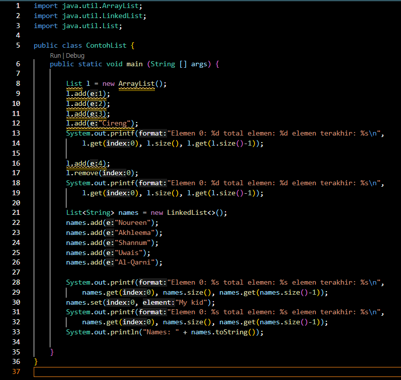
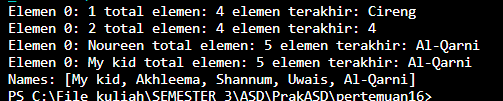

### Pertanyaan Praktikum 1

1. Perhatikan baris kode 25-36, mengapa semua jenis data bisa ditampung ke dalam sebuah 
Arraylist?

Jawab:

Karena pada kode 25-36 terdapat arraylist yang tidak ada kurung sudut yang secara spesifik pada data yang akan disimpan didalamnya, sehingga sintaknya umum dan dapat menyimpan segala jenis tipe data.

2. Modifikasi baris kode 25-36 seingga data yang ditampung hanya satu jenis atau spesifik tipe tertentu!

Jawab:

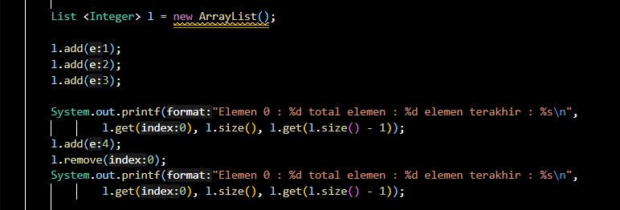
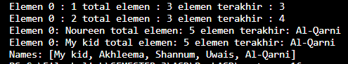

3. Ubah kode pada baris kode 38 menjadi seperti ini

LinkedList<String> names = new LinkedList<>();

Jawab:

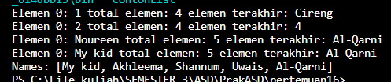

4. Tambahkan juga baris berikut ini, untuk memberikan perbedaan dari tampilan yang sebelumnya

names.push("Mei-mei");
    System.out.printf("Elemen 0: %s total elemen: %s elemen terakhir: %s\n",
        names.getFirst(), names.size(), names.getLast());
    System.out.println("Names: " + names.toString());

Jawab:

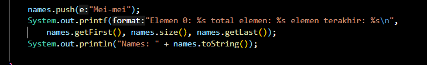
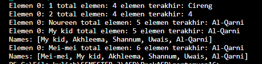

5. Dari penambahan kode tersebut, silakan dijalankan dan apakah yang dapat Anda jelaskan!

Jawab:

Menggunakan class Lingkedlist dapat menggunakan method lingked list seperti  push(), getFirst(), getLast(), tetapi ketika menggunakan class List tidak bisa.

## Program dan Output Praktikum 2
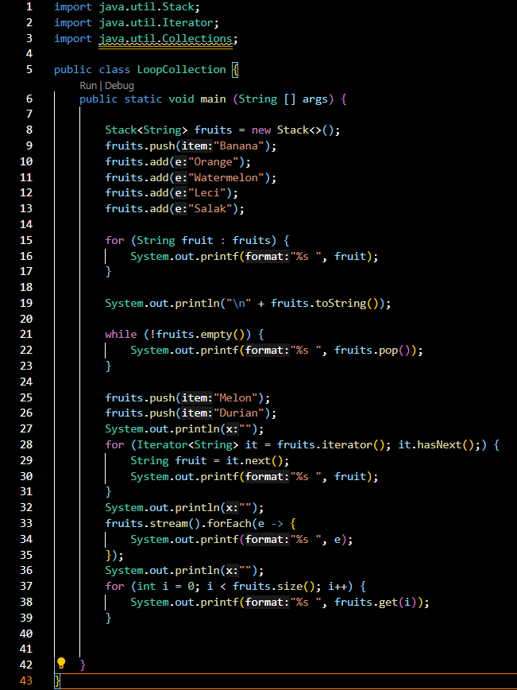
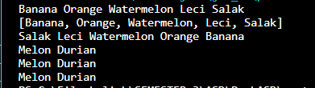

### Pertanyaan Praktikum 2

1. Apakah perbedaan fungsi push() dan add() pada objek fruits?

Jawab:

Fungsi push() dan add() diatas sama sama menambahkan elemen, yang membedakan adalah push() merupakan fungsi dari interface stack. Sedangkan, add() tidak atau bukan interface dari stack

2. Silakan hilangkan baris 43 dan 44, apakah yang akan terjadi? Mengapa bisa demikian?

Jawab:

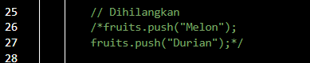
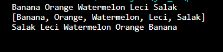

terjadi ketridakmunculnya data "melon" dan "durian", hal ini dikarenakan saat mengakses fungsi push() maka akan menambahkan data "melon" dan "durian".

3. Jelaskan fungsi dari baris 46-49?

Jawab:

- Pada baris 46 berfungsi untuk proses inisialisasi dan mengatur aturan perulangan sesuai perintah yang di instruksikan. 
- Pada baris 47 adalah untuk pembuatan variabel fruit menjadi it.next(). 
- Pada baris 48 berfungsi untuk mencetak variabel fruit.

4. Silakan ganti baris kode 25, Stack<String> menjadi List<String> dan apakah yang terjadi? Mengapa bisa demikian?

Jawab:

Terjadi eror pada bagian push, empty, pop karena tidak dapat dijalankan pada interface list, yang mana perintah yang diatas adalah fungsi dari interface stack

5. Ganti elemen terakhir dari dari objek fruits menjadi “Strawberry”!

Jawab: 

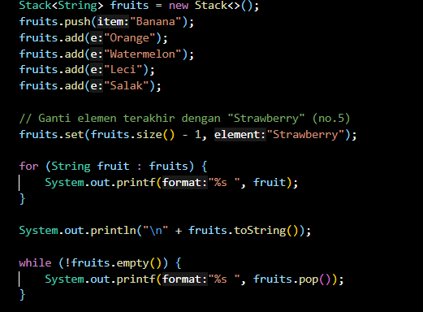
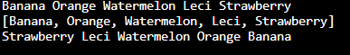

6. Tambahkan 3 buah seperti “Mango”,”guava”, dan “avocado” kemudian dilakukan sorting!

Jawab:

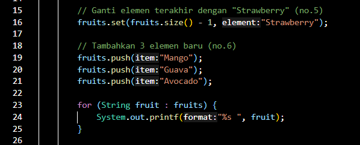
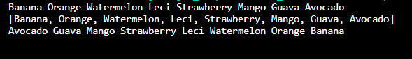

## Program dan Output Praktikum 3
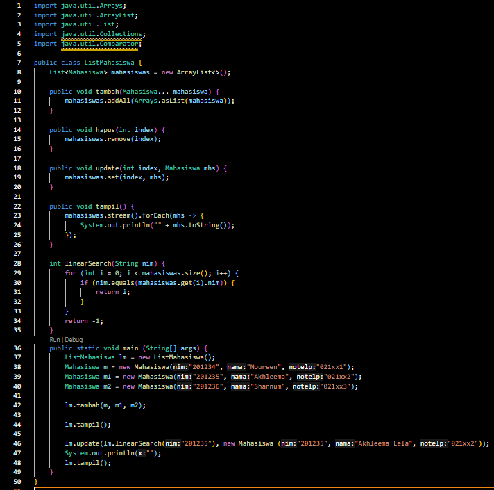
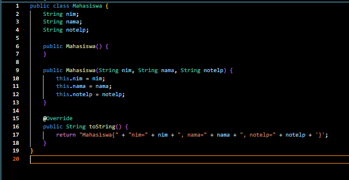
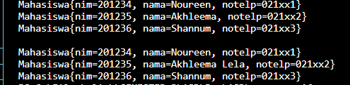

### Pertanyaan Praktikum 3

1. Pada fungsi tambah() yang menggunakan unlimited argument itu menggunakan konsep apa? Dan kelebihannya apa?

Jawab:

Pada fungsi tambah() menggunakan konsep atau method addAll() dari collections dimana konsep ini memiliki kelebihan dapat menambahkan element tanpa ada batas jumlah elemen yang ditambahkan

2. Pada fungsi linearSearch() di atas, silakan diganti dengan fungsi binarySearch() dari collection!

Jawab:

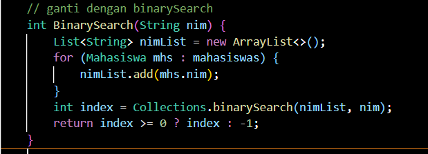
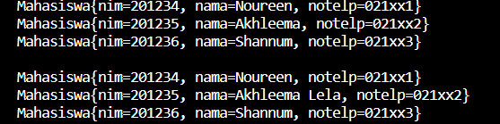

3. Tambahkan fungsi sorting baik secara ascending ataupun descending pada class tersebut!

Jawab:

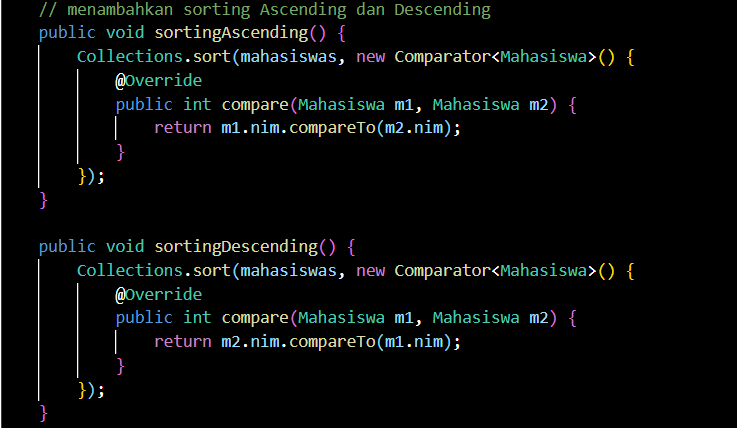
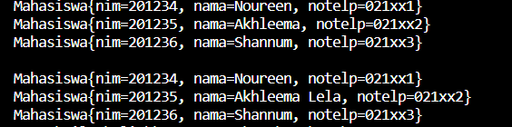

## Program dan Output Praktikum 4

- Menggunakan Hashtable dengan pendekatan OOP
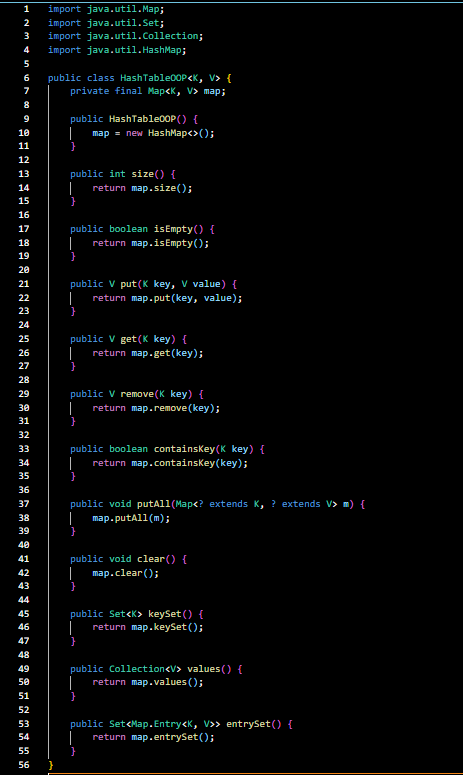
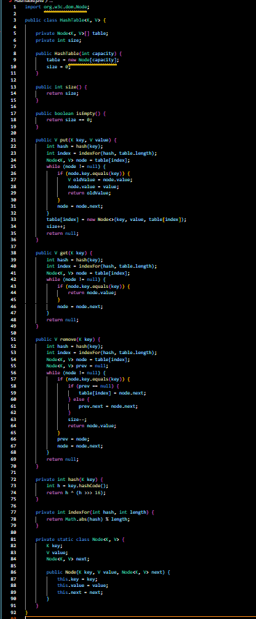
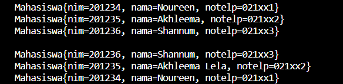

## Program dan Output Tugas

1. Buatlah implementasi program daftar nilai mahasiswa semester, minimal memiliki 3 class yaitu Mahasiswa, Nilai, dan Mata Kuliah. Data Mahasiswa dan Mata Kuliah perlu melalui penginputan 

data terlebih dahulu. 
Ilustrasi Program
Menu Awal dan Penambahan Data

Jawab:

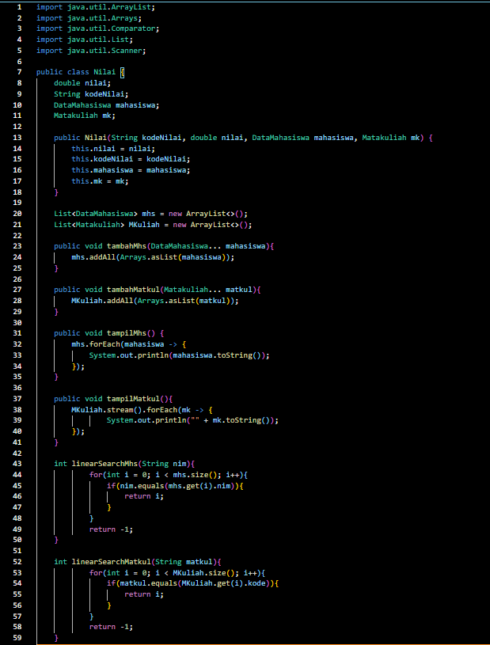
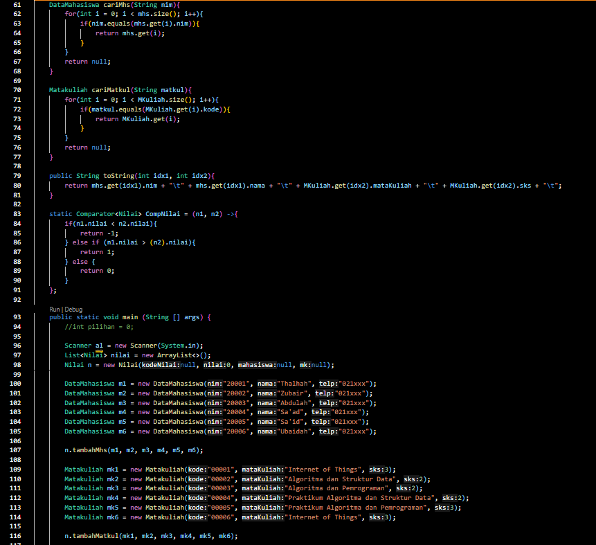
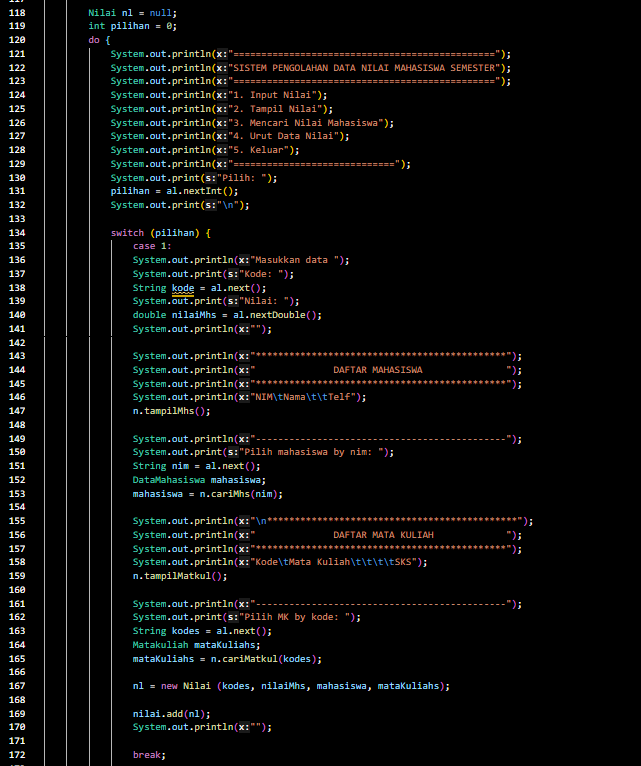
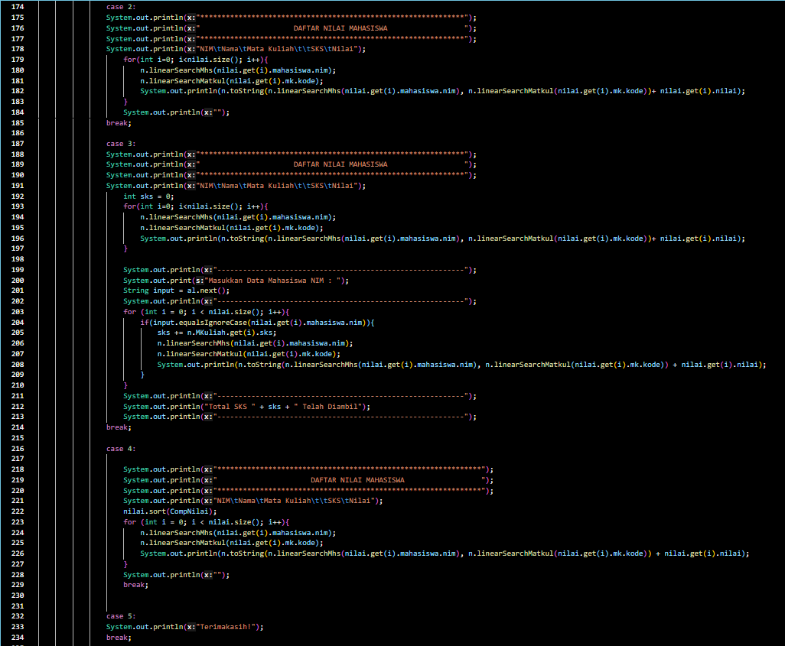
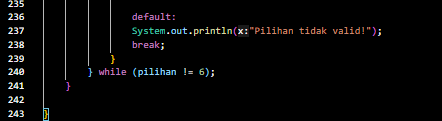
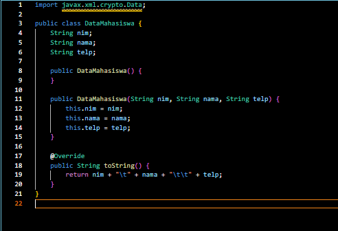
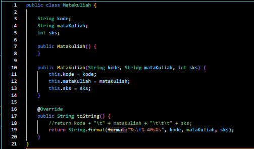
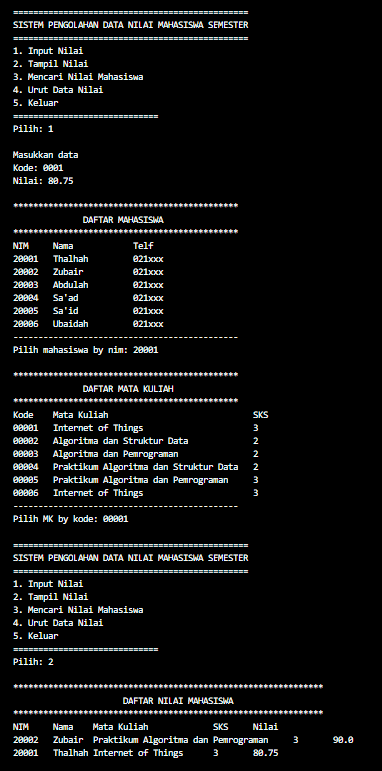
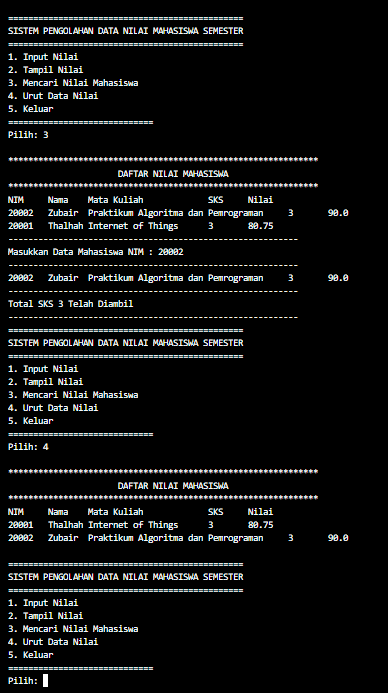

2. Tambahkan prosedur hapus data mahasiswa melalui implementasi Queue pada collections Tugas nomor 1!

Jawab:

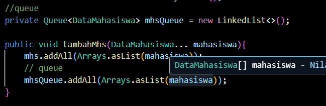
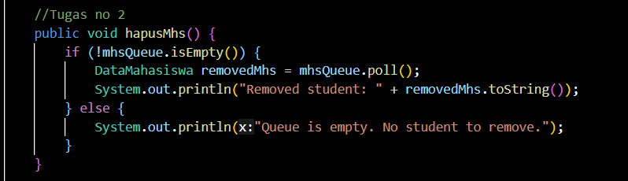
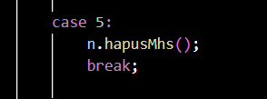
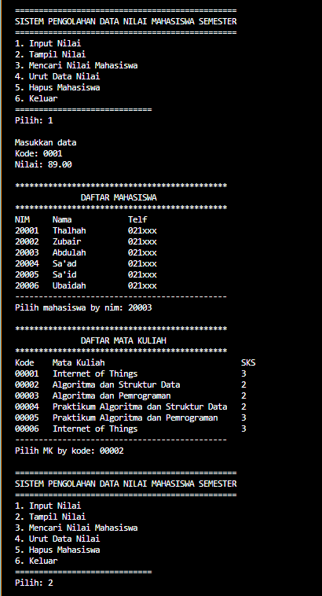
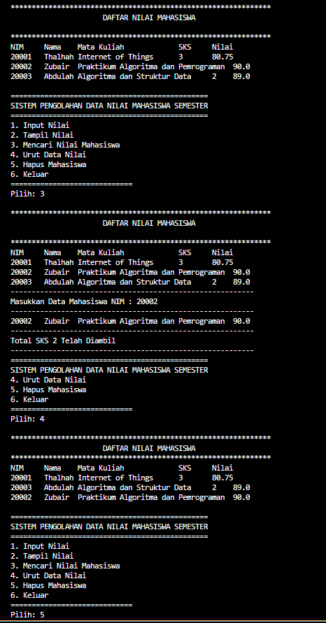
