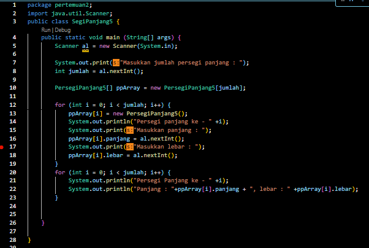

# laporan praktikum pertemuan 2
NIM     : 2241760050
NAMA    : ALDAMAITA SALWA SALSABILA
KELAS   : SIB 2B

## output 2.2.

### pertanyaan 2.2.
1. Sebutkan 2 karakteristik class/objek!
    >
2.	Kata kunci apakah yang digunakan untuk mendeklarasikan class?
    > Kata kunci yang digunakan untuk mendeklarasikan class adalah kata kunci class
3.	Perhatikan class Film yang ada di Praktikum di atas, ada berapa atribut yang dimiliki oleh class tersebut? Sebutkan! Dan pada baris berapa saja deklarasi atribut dilakukan?
    > Pada class di atas memiliki 5 atribut, diantaranya :
    - judul : String
    - genre : String
    - rate : String
    - jumlahTiket : int
    - hargaTiket : int
    deklarasi atribut dilakukan pada baris 4 dan 5
4.	Ada berapa method yang dimiliki oleh class tersebut? Sebutkan!
    > Di dalam class di atas terdapat 4 method, diantaranya :
    - tampilFilm () : void
    - tambahkanTiket (int n) : void
    - kurangiTiket (int n) : void
    - totalRevenue (int jumlah) : void
5.	Perhatikan method kurangiTiket() yang ada di class Film, modifikasi isi method tersebut sehingga proses pengurangan hanya dilakukan jika stok masih ada (masih lebih besar dari 0)
    > 
6.	Menurut Anda, mengapa method tambahTiket() dibuat dengan memiliki 1 parameter berupa bilangan int?
    > Hal ini dikarenakan agar memungkinkan penambahan jumlah tiket secara fleksibel. Dengan
    ini kita dapat menentukan berapa banyak tike yang akan ditambahkan pada saat
    pemanggilan method. Kita juga bisa menentukan jumlah tiket yang diinginkan (sesuai
    kebutuhan).
7.	Menurut Anda, mengapa method totalRevenue() memiliki tipe data int?
    > Karena ini bertujuan agar dapat mengembalikan nilai total pendapat berdasarkan jumlah
    tiket yang terjual, dikali dengan harga tiket. Hasil yang dimunculkan lebih sesuai
    menggunakan tipe data ‘int’, karena ‘int’ digunakan untuk menghitung jumlah bilangan
    bulat. 
8.	Menurut Anda, mengapa method tambahTiket() memiliki tipe data void?
    > Karena metode ini tidak perlu mengembalikan nilai atau hasil operasi  dan juga untuk mengubah nilai dari atribut jumlahTiket yang ada di dalam objrk Film5

## ouput 2.3

### pertanyaan 2.3
1.	Pada class FilmMain, pada kode apa yang digunakan untuk proses instansiasi? Apa nama objek yang dihasilkan?
    > Pada class FilmMain nama objek yang digunakan untuk proses instansi yaitu film1
2.	Bagaimana cara mengakses atribut dan method dari suatu objek?
    > Pada pemograman di atas untuk mengakses atribut menggunakan ‘film1’, misalnya
    film1.judul, film1.genre, film1.rate, film1.jumlahTiket, film1.hargaTiket. Dengan
    menggunakan pernyataan tersebut, kita dapat mengakses nilai dari masing-masing atribut
    pada objek ‘film1’. Sedangkan, untuk method sama dengan atribut yaitu menggunakan
    objek ‘film1’ akan tetapi penerapannya sedikit berbeda, misalnya film1.tambahTiket(1),
    film1.kurangiTiket(3), film1.tampilFilm(), int income = film1.totalRevenue(4). Dengan
    menggunakan pertanyaatn tersebut, kita dapat memanggil method yang ada di dalam objek
    ‘film1’ dan mengoprasikannya sesuai fungsi yang diinginkan.

## ouput 2.4

### pertanyaan 2.4
1. pada baris berapakah deklarasi konstruktor berparameter dilakukan?
    > Konstruktor yang berparameter terjadi pada baris ke 8 hingga 13. Konstruktor menerima
    lima parameter, diantaranya ‘judul = jd’, ‘genre = gr’, ‘rate = rt’, ‘jumlahTiket = jt’,
    ‘hargaTiket = ht’. Saat menggunakan konstruktor, nilai-nilai dari parameter akan digunakan
    untuk menginisialisasi atribut-atribut pada objek ‘Film’ yang beru dibuat.
2.	Perhatikan class FilmMain di Praktikum 2.4.1, apa sebenarnya yang dilakukan pada baris program dibawah ini?
Film film2 = new Film ("Maniaquantum", "Horor", "Dewasa", 200, 40000);
    > Dalam baris tersebut, objek ‘film2’ dibuat untuk instance dari kelas ‘Film’.konstruktor yang
    dipakai adalah konstruktor berparameter yang menerima lima nilai, diantaranya
    "Maniaquantum" (judul), "Horor" (genre), "Dewasa" (rate), 200 (jumlahTiket), dan 40000
    (hargaTiket). Dengan ini, objek ‘film2’ diinisialisasikan dengan nilai-nilai yang disediakan
    dalam kostruktor. Lalu objek dapat digunakan untuk mengakses atribut dan method yang
    ada di dalam class ‘Film’.
3.	Coba buat objek dengan nama film3 dengan menggunakan konstruktor berparameter dari class Barang.
    > 

## kode dan ouput 2.5

### pertanyaan 2.5
1.	Berdasarkan uji coba 3.2, apakah class yang akan dibuat array of object harus selalu memiliki atribut dan sekaligus method?Jelaskan!
    > Tidak, class yang digunakan tidak harus selalu memiliki atribut dan method. Dalam kasus ini, class
    PersegiPanjang hanya memiliki dua atribut yaitu panjang dan lebar tanpa adanya method. Akan
    tetapi, kita masih bisa menggunakan class tersebut untuk membuat array of objects dan dapat
    menyimpan sekaligus mengakses data persegi panjang yang berbeda.
2.	Apakah class PersegiPanjang memiliki konstruktor?Jika tidak, kenapa dilakukan pemanggilan konstruktur pada baris program berikut :
ppArray[1] = new PersegiPanjang5();
    > Tidak, class PersegiPanjang tidak memiliki konstruktor eksplisit, akan tetapi terdapat konstruktor
    bawaan . pada konstruktor bawaan, nilai-nilai atribut dalam objek akan diinisialisasikan denngan nilai defaut. Contohnya, untuk tipe data numerikseperti ‘int’, nilai defaultnya adalah 0. Oleh karena itu, ketika objek PersegiPanjang baru dibuat menggunakan konstruktor bawaan, nilai-nilai atribut panjang dan lebar akan diatur menjadi 0. Pada baris ppArray[1] = new persegiPanjang (); digunakan untuk membuat objek ‘PersegiPanjang’ yang baru dan menginisialisasikan elemen array ‘ppArray’ indeks ke-1 dengan objek tersebut. 
3.	Apa yang dimaksud dengan kode berikut ini:
PersegiPanjang5[] ppArray = new PersegiPanjang5[3];
    > Kode di atas di gunakan untuk membuat sebuah array yang dapat menampung objek-objek dari tipe data PersegiPanjang. Pada baris ini, kita mendeklarasikan sebuah variabel ‘ppArray’ dengan tipe data ‘PersegiPanjang[]’, yang berarti variabel tersebut adalah sebuah array yang berisikan kumpulan objek dari tipe data. Lalu kita menginisialisasi dengan ‘new’ dan menentukan ukuran array yang menampung 3 objek jika dilihat pada kode di atas.
4.	Apa yang dimaksud dengan kode berikut ini:
ppArray[1] = new PersegiPanjang5();
ppArray[1].panjang = 80;
ppArray[1].lebar = 40;
    > Kode di atas digunakakn untuk membuat objek ‘PersegiPanjang’ baru dan menyimpan pada
    indeks ke-1 dari array ‘ppArray’. Pada kode ppArray[1] = new PersegiPanjang(); dapat dijelaskan bahwa elemen kedua menginisialisasi dari array ‘ppArray’ dengan objek ‘PersegiPanjang’ baru yang dibuat menggunakan konstruktor default. Dengan begitu, elemen kedua dari array sekarang berisi referensi ke objek yang beru. Lalu, pada baris-baris berikutnya kita mengakses objek ‘PersegiPanjang’ yang ada pada elemen kedua dari array (indeks 1) dan mengatur nilai atribut ‘panjang’ menjadi 80 dan atribut ‘lebar’ menjadi 40.
5.	Mengapa class main dan juga class PersegiPanjang dipisahkan pada uji coba 3.2?
    > Class main dan PersegiPanjang dipisahkan karena untuk memisahkan tanggung jawab dan peran masing-masing class. Selain itu, dengan memisahkan class memungkinkan kita untuk memisahkan logika program utama dari implementasi detail onjek persegi panjang. Pemisahan ini juga meningkatkan keterbacaan dan pemeliharaan kode. 

## kode dan ouput 2.6

### pertanyaan 2.6
1.	Apakah array of object dapat diimplementasikan pada array 2 Dimensi?
    > Bisa, array of object dapat diimplementasikan dalam array dua dimensi. Hal ini dikarenakan, kita dapat menggunakan array dua dimensi untuk menyimpan objek-objek dari class ‘PersegiPanjang’. Misal, kita menggunakan array dua dimensi ‘ppArray’ dengan ukuran 2 x 3 untuk menyimpan objek-objek ‘PersegiPanjang’. Kemudian, kita dapat mengakses dan mengatur nilai atribut ‘ppArray[i][j].lebar’. Ketika kita menggunakan array dua dimensi, kita dapat menyimpan dan mengelola sejumlah objek dalam stuktur yang terorganisir.
2.	Jika jawaban soal no satu iya, berikan contohnya! Jika tidak, jelaskan!
    > 
    
    
3.	Jika diketahui terdapat class Persegi yang memiliki atribut sisi bertipe integer, maka kode dibawah ini akan memunculkan error saat dijalankan. Mengapa?
Persegi [] pgArray = new Persegi[100];
pgArray[5].sisi = 20;
    > Hal ini terjadi dikarenakan saat mendeklarasikan array ‘pgArray’ dengan ‘Persegi[] pgArray = new Persegi{100]; ’ , hanya array ‘pgArray’ yang dibuat. Sedangkan elemen-elemen belum diinisialisasi. 
    Oleh karena itu, saat Anda mencoba mengakses elemen ke – 5 dengan ‘pgArray[5]’, belum ada objek ‘Persegi’ yang diinisialisasi di dalamnya. Sehingga, ketika Anda mencoba mengakses atribut ‘sisi’ dengan ‘pgArray[5].sisi’ akan terjadi ‘NullPointerException’ karena tidal ada objek yang dapat diakses.
4.	Modifikasi kode program pada praktikum 3.3 agar length array menjadi inputan dengan Scanner!
    >
     
5.	Apakah boleh Jika terjadi duplikasi instansiasi array of objek, misalkan saja instansiasi dilakukan pada ppArray[i] sekaligus ppArray[0]?Jelaskan !
    > Tidak boleh, karena saat mendeklarasi dan menginisialisasi array of object , array tersebut memiliki tiga elemen yang dapat diakses melalui indeks 0,1, 2. Ketika melakukan instansi objek pada indeks tertentu seperti ‘ppArray[i] = new PersegiPanjang();’ , kita mengalokasikan memori  untuk objek baru pada elemen array tersebut. Jika n kita mencoba melakukan instansiasi objek pada indeks yang sama, misal ‘ppArray[0] = new PersegiPanjang(); ‘ , maka objek yang sebelumnya diinisialisasi pada indeks 0 akan tergantikan dengan objek baru. Dengan demikian, elemen array hanya memiliki satu objek terakhir yang diinisialisasikan pada indeks sama.

## kode dan ouput 2.7

### pertanyaan 2.7
1.	Dapatkah konstruktor berjumlah lebih dalam satu kelas? Jelaskan dengan contoh!
    > Bisa, dalam sebuah class terdapat lebih dari satu konstruktor dengan parameter yang berbeda. Setiap konstruktor memiliki untuk menginisialisasi objek dengan cara yang berbeda, tergantung pada parameter yang diterima. Contoh dalam kode di atas , dalam class Balok konstruktor pertama tidak memiliki parameter dan menginisialisasi panjang, lebar, dan tinggi dengan nilai default 0. Konstruktor kedua menerima tiga parameter panjang, lebar, dan tinggi, dan menginisialisasi atribut dengan nilai yang diberikan. Dengan adanya dua konstruktor tersebut, kita dapat membuat objek Balok menggunakan konstruktor yang sesuai dengan kebutuhan kita.
2.	Jika diketahui terdapat class Segitiga seperti berikut ini:
    public class Segita {
        public int alas;
        public int tinggi;
    }
Tambahkan konstruktor pada class Segitiga tersebut yang berisi parameter int a, int t
yang masing-masing digunakan untuk mengisikan atribut alas dan tinggi.
    > 
    
3.	Tambahkan method hitungLuas() dan hitungKeliling() pada class Segitiga tersebut. Asumsi segitiga adalah segitiga siku-siku. (Hint: Anda dapat menggunakan bantuan library Math pada Java untuk mengkalkulasi sisi miring)
    > 
    
4.	Pada fungsi main, buat array Segitiga sgArray yang berisi 4 elemen, isikan masing- masing atributnya sebagai berikut:
sgArray ke-0	alas: 10, tinggi: 4
sgArray ke-1	alas: 20, tinggi: 10
sgArray ke-2	alas: 15, tinggi: 6
sgArray ke-3	alas: 25, tinggi: 10
Kemudian menggunakan looping, cetak luas dan keliling dengan cara memanggil method
hitungLuas() dan hitungKeliling().
    > 
    
    

## kode dan output Tugas
### Pertanyaan
1. Buat program berdasarkan diagram class berikut ini!  
    Nasabah
    Id: int
    nama: String
    alamat: String
    noHP: int
    noRek: int
    saldo: int
    jmlHutang: float
    statusAktif: boolean
    lihatSaldo(): int
    menabung(deposit: int): int
    tarikTunai(jmlTarik: int): int
    bukaRekening(): void
    tutupRekening(): void
    berhutang(jmlHutang: int): void
    o Method lihatSaldo() digunakan untuk melihat kondisi saldo tabungan
    o Method menabung() digunakan untuk menambah saldo sesuai nominal parameter deposit yang dimasukkan
    o Method tarikTunai() digunakan untuk mengurangi saldo sejumlah parameter jmlTarik
    o Method bukaRekening() digunakan nasabah untuk pertama kali. Jika nasabah belum memiliki rekening, maka statusAktif false dan tidak boleh melakukan aktifitas lihatSaldo(), menabung(),tarikTunai()tutupRekening(),dan berhutang().
    o Method tutupRekening() digunakan untuk menonaktifkan rekening sehinggan nasabah tidak lagi dapat melakukan aktifitas lihatSaldo(), menabung(), tarikTunai(),tutupRekening(), dan berhutang().
    o Method berhutang() digunakan untuk mengajukan pinjaman dengan aturan berikut:
    ▪ Jika jmlHutang >= saldo, akan muncul peringatan ajuan peminjaman ditolak
    ▪ Jika jmlHutang <= saldo, pinjaman disetujui dan dimunculkan simulasi skema cicilan per bulan
    ▪ Seluruh cicilan harus dihitung dalam waktu 6 bulan
    ▪ Simulasi skema cicilan per bulan dihitung dari jumlah hutang di rekening/6. Jangan lupa 
    menggunakan konversi tipe data int ke float.
2. Berdasarkan soal nomor 1, terapkan kasus lebih dari 1 nasabah menggunakan object of array!
    > 
    
    
3. Berdasarkan soal nomor 1 dan 2 terapkan kasus 1 nasabah dapat memiliki lebih dari 1 rekening menggunakan array biasa
    > 
    
    
    
    
    
