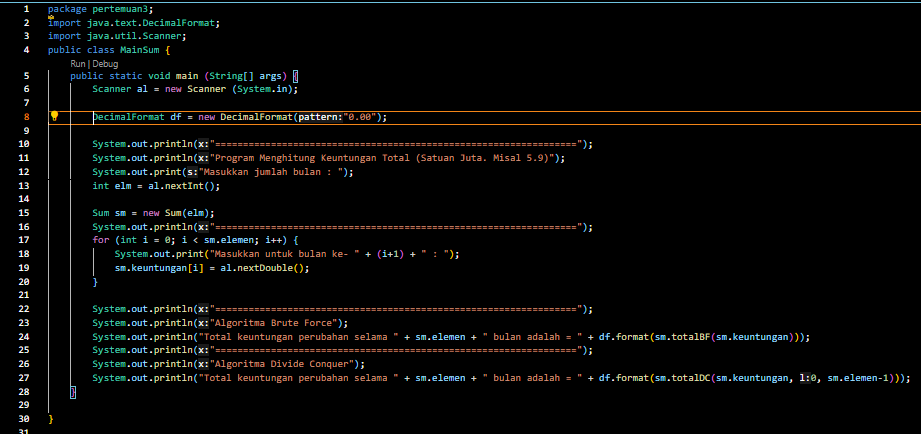

# Laporan praktikum pertemuan 3
NIM     : 2241760050

NAMA    : ALDAMAITA SALWA SALSABILA

KELAS   : SIB 2B

## Kode dan Output 4.2

### Pertanyaan 4.2
1. Jelaskan mengenai base line Algoritma Divide Conquer untuk melakukan pencarian nilai faktorial!
    > Algoritma Divide and Conquer digunakan untuk mencari nilai faktorial yang memiliki base case yang mengecek apakah n sama dengan 1. Jika n sama dengan 1, maka hasil faktorial adalah 1. Ini adalah kondisi dasar yang menghentikan rekursi.

2. Pada implementasi Algoritma Divide and Conquer Faktorial apakah lengkap terdiri dari 3 tahapan divide, conquer, combine? Jelaskan masing-masing bagiannya pada kode program!
    > divide 
        
        if (n==1) {
            return 1;
        }
    
    conquer
        
        else
        {
            int fakto = n * faktorialDC(n-1);
        }
    
    combine
        
        return fakto;

3. Apakah memungkinkan perulangan pada method faktorialBF() dirubah selain menggunakan for? Buktikan!
    > Ya, memungkinkan menggunakan perulangan pada method faktorialBF() selain for, dan disini saya menggunakan while
    Bukti :

4. Tambahkan pegecekan waktu eksekusi kedua jenis method tersebut!
    > 

5. Buktikan dengan inputan elemen yang di atas 20 angka, apakah ada perbedaan waktu eksekusi?
    > 

## Kode dan Output 4.3

### Pertanyaan 4.3
1. Jelaskan mengenai perbedaan 2 method yang dibuat yaitu PangkatBF() dan PangkatDC()!
    >pangkatBF() :
    1. menggunakan Brute Force 
    2. menggunakan loop 'for'
    3. perpangkatan dengan eksponen kecil
    4. banyak perkalian berulang

    pangkatDC() :
    1. menggunakan pendekatan Divide Conquer
    2. perpangkatan menjadi dua submasalah yang lebih kecil dan kemudian menggabungkan hasilnya. Ketika eksponen adalah bilangan genap, ia memangkas masalah menjadi dua bagian yang sama, sedangkan ketika eksponen adalah bilangan ganjil, ia memangkas masalah menjadi dua bagian yang sama dan kemudian mengalikan hasilnya dengan basis.

2. Pada method PangkatDC() terdapat potongan program sebagai berikut:
    
    if (n%2==1)//bilangan ganjil
        return (pangkatDC (a,n/2)*pangkatDC(a, n/2) *a);
    
    else // bilangan genap
        return (pangkatDC(a,n/2) *pangkatDC(a,n/2));

Jelaskan arti potongan kode tersebut
    
    > Potongan kode tersebut awalnya memeriksa apakah eksponen n adalah bilangan ganjil atau genap dengan menggunakan operasi modulo (%). Jika hasil dari n % 2 adalah 1, maka eksponen n adalah bilangan ganjil. Pada bilangan ganjil, menggunakan metode Divide and Conquer memecah masalah perpangkatan menjadi dua bagian yang sama, yaitu pangkatDC(a, n/2) dan pangkatDC(a, n/2). Setelah kedua submasalah tersebut dipecahkan secara rekursif dan menghasilkan nilai, hasilnya dikalikan dengan basis a. Ini dilakukan karena perpangkatan dengan eksponen ganjil dapat dibagi menjadi dua perpangkatan dengan eksponen setengah yang kemudian dikalikan bersama. Jika hasilnya bukan 1 (yaitu 0), maka eksponen n adalah bilangan genap. Pada bilangan genap, menggunakan metode Divide and Conquer memecah masalah perpangkatan menjadi dua bagian yang sama, yaitu pangkatDC(a, n/2) dan pangkatDC(a, n/2). Hasil kedua submasalah ini dipecahkan secara rekursif dan kemudian digabungkan bersama. Karena eksponen genap dapat dibagi menjadi dua perpangkatan dengan eksponen setengah yang kemudian digabungkan.

3. Apakah tahap combine sudah termasuk dalam kode tersebut?Tunjukkan!
    > Sudah, tahap Combine ditunjukkan pada sintaks return atau pengembalian nilai,dimana hasil Conquer sebelumnya di return kan semua. Dan tahap Combine dilakukan pemanggilan hasil. 
   
    pangkatDC(a,n/2)*pangkatDC(a,n/2)*a) 

4. Modifikasi kode program tersebut, anggap proses pengisian atribut dilakukan dengan konstruktor.
    > 

5. Tambahkan menu agar salah satu method yang terpilih saja yang akan dijalankan!
    > 
    

## Kode dan Output 4.4

### Pertanyaan 4.4
1. Berikan ilustrasi perbedaan perhitungan keuntungan dengan method TotalBF() ataupun TotalDC()
    > 
    - TotalBF() :
    
    untuk melakukan penjumlahan semua elemen array[i] yang nanti dimasukkan pada operasi penjumlahan variabel total dan di return kan variabel totalnya. 
    
    Total keuntungan = 5.0 + 3.0 + 2.0 + 4.0 = 14.0

    - TotalDC()
    
    menggunakan fungsi rekursif. Untuk melakukan proses devide yang diimplementasikan dengan pemilihan. Melakukan tahapan Conquer untuk menyelesaikan setiap masalah. Pada tahap akhir semua hasil penyelesaian dijadikan satu menjadi solusi. 

    Memecah data menjadi dua bagian: [5.0, 3.0] dan [2.0, 4.0]
    
    Total pertama = 5.0 + 3.0 = 8.0
    
    Total kedua = 2.0 + 4.0 = 6.0
    
    Menggabungkan total pertama dan kedua = 8.0 + 6.0 = 14.0
    

2. Perhatikan output dari kedua jenis algoritma tersebut bisa jadi memiliki hasil berbeda di belakang koma. Bagaimana membatasi output di belakang koma agar menjadi standar untuk kedua jenis algoritma tersebut.
    > 

3. Mengapa terdapat formulasi return value berikut?Jelaskan!
    
    return lsum+rsum+arr(mid);
    
    > formulasi diatas menggunakan tahap Combine. Hal ini untuk menggabungkan hasil dari kedua submasalah yang lebih kecil menjadi hasil akhir dari masalah yang lebih besar. Ketika method 'totalDC' dipanggil secara rekursif, perhitungan total dibagi menjadi 2 masalah lebih kecil(tahap divide). Setiap submasalah menghitung total keuntungan. Lalu menghitung total untuk setiap submasalah(tahap conquer). Hasil dari submasalah sebelah kiri (lsum) dan sebelah kanan (rsum) digabungkan bersama dengan keuntungan pada elemen tengah (arr[mid]). Hasil dari ketiga komponen ini adalah total keuntungan untuk seluruh rentang yang sedang diproses.

4. Kenapa dibutuhkan variable mid pada method TotalDC()?
    > valiable mid dibutuhkan pada method TotalDC() supaya dapat membagi masalah besar menjadi 2 submasalah yang lebih kecil. 'mid' digunakan untuk memahami dan mengelola pembagian dan penggabungan masalah dalam algoritma divide conquer dan membantu dalam mengidentifikasi elemen tengah yang diperlukan untuk perhitungan, serta menentukan rentang yang benar untuk submasalah yang lebih kecil.

5. Program perhitungan keuntungan suatu perusahaan ini hanya untuk satu perusahaan saja. Bagaimana cara menghitung sekaligus keuntungan beberapa bulan untuk beberapa perusahaan.(Setiap perusahaan bisa saja memiliki jumlah bulan berbeda-beda)? Buktikan dengan program!
    > 

    

## Kode dan Output 4.5

