# Laporan Praktikum Pertemuan 5
Nama    : Aldamaita Salwa Salsabila

NIM     : 2241760050

Kelas   : SIB 2B

## Kode dan Ouput 4.2

### Pertanyaan 4.2
1. Perhatikan class MahasiswaMain, jelaskan fungsi kode program berikut ini!

if (cari.equalsIgnoreCase(mhs[i].namaMahasiswa))

Jawab :

Program diatas berfungsi untuk mencari nama mahasiswa dalam array 'mhs' berdasarkan nama yang telah dimasukkan oleh pengguna, lalu membandingkan nama tersebut dengan array.

2. Lakukan modifikasi pada program tersebut, sehingga jika data yang dicari tidak ditemukan, maka akan menampilkan “Data tidak ditemukan”!

Jawab :

3. Lakukan modifikasi pada program tersebut agar pencarian dilakukan bukan berdasarkan nama mahasiswa, melainkan berdasarkan IPK!

Jawab :

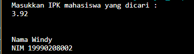

## Kode dan Ouput 4.3

### Pertanyaan 4.3
1. Perhatikan class PencarianMain, jelaskan fungsi dari kode kode program berikut ini!
 
 OrderedSearch al = new OrderedSearch(data);

 Jawab :

Program diatas berfungsi untuk menginisialisasikan 'arr' dari objek 'al'. Properti 'arr' akan berisi salinan dari 'data' yang diberikan.

2. Perhatikan class Pencarian, pada method Cari terdapat dua kali break. Jelaskan fungsi masing-masing break tersebut pada kode program tersebut!

Jawab :

Pada break yang pertama, digunakan untuk menghentikan loop setelah nilai keyword yang dicari ditemukan dalam array 'arr'. Ketika nilai keyword sama dengan elemen yang ditemukan di indeks i, maka index akan diisi dengan nilai i, dan pernyataan break akan menghentikan loop. Ini berarti bahwa pencarian berhenti setelah nilai pertama yang cocok ditemukan. 
Pada break yang kedua, digunakan dalam kasus di mana nilai keyword lebih kecil daripada elemen saat di indeks i. Ini menunjukkan bahwa nilai keyword yang dicari tidak akan ditemukan dalam array yang telah diurutkan (karena array diurutkan dari yang terkecil ke yang terbesar). Dalam situasi ini, pencarian dihentikan karena tidak ada nilai yang lebih besar yang akan cocok dengan keyword. Ini mengoptimalkan pencarian dan menghindari iterasi lebih lanjut jika nilai yang dicari tidak ada dalam array atau jika nilai tersebut pasti lebih kecil dari elemen-elemen yang ada dalam array.

3. Lakukan modifikasi pada program tersebut sehingga data array dapat bersifat dinamis (dapat diinputkan oleh pengguna)!

Jawab :

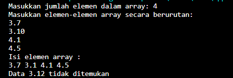

### Tugas No 1
Terdapat sebuah array satu dimensi sebagai berikut:

Index 0  1   2  3  4  5  6    7  8   9
Array 17 20 26 33 37 41  53  65  73  83

Buatlah program untuk mencari sebuah nilai x dan tentukan jenis sequential search manakah yang optimal dan cocok untuk array diatas dengan:
a. x=41

    - order
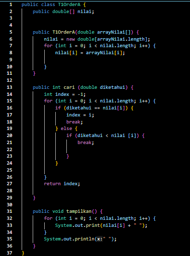
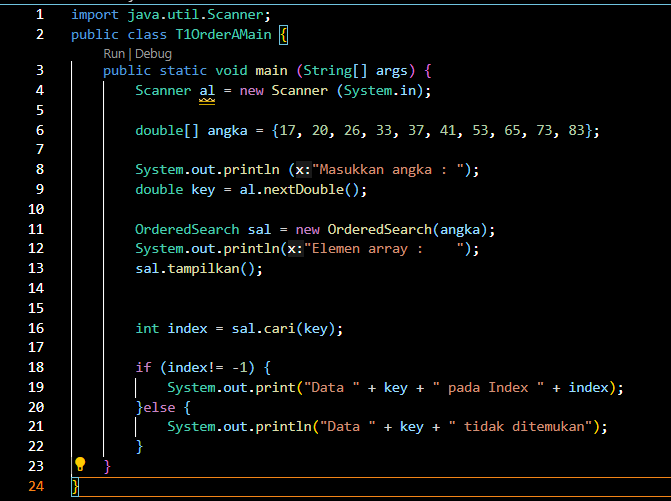
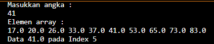

    - unorder
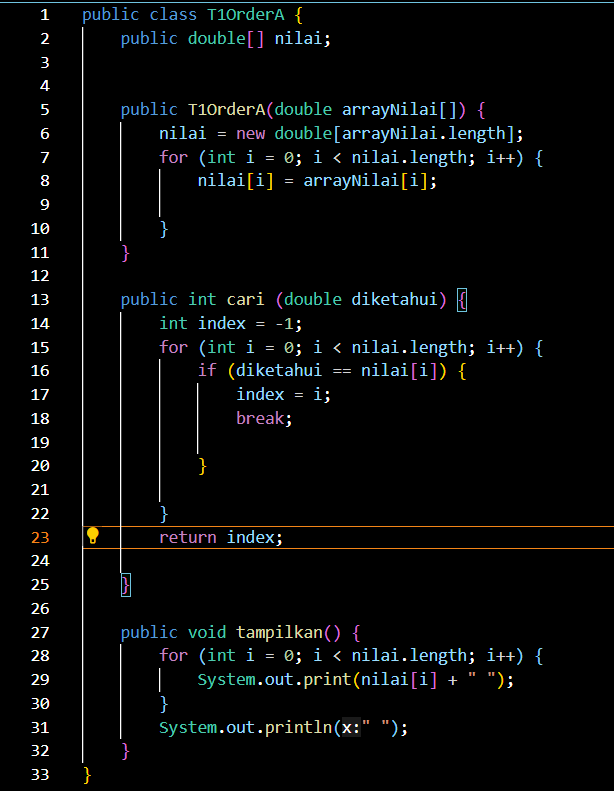
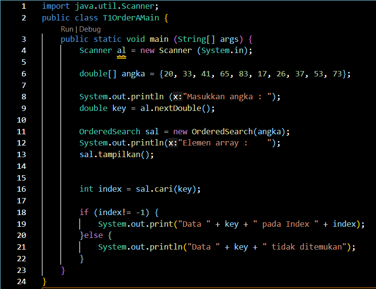
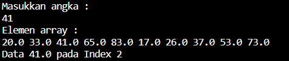

b. x=50

    - order

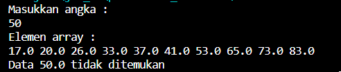

    - unorder

### Tugas No 2
Terdapat sebuah array dua dimensi yang menggambarkan nama mahasiswa pada 3 kelompok yang berbeda dalam satu kelas. Baris menunjukkan kelompok, sedangkan kolom menunjukkan data mahasiswa dalam satu kelompok dengan contoh seperti di bawah ini.
Urutan 1 2 3 4 5
Kelompok Indeks     0       1       2       3       4
    1      0      “Alfi” “Safira” “Tiara” “Arif” “Erdi”
    2      1      “Yudha” “Nisa” “Yulia” “Fauzan” “Dwi”
    3      2      “Dewa”   “Ana”  “Abdul”  “Dani” “Ammar”
Berdasarkan data tersebut, buatlah program untuk melakukan pencarian data kelompok dan urutan mahasiswa, dimana data nama mahasiswa yang dicari diinputkan melalui keyboard!

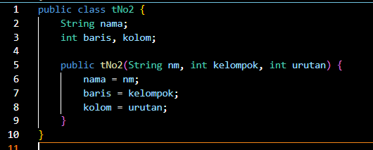
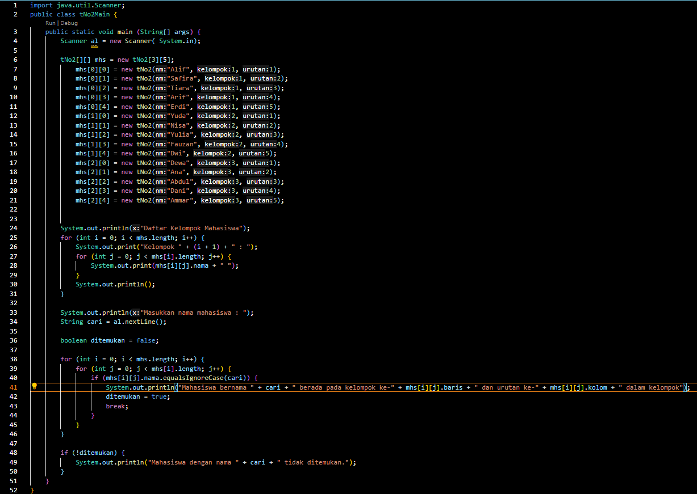

### Tugas No 3
Terdapat sebuah array satu dimensi sebagai berikut:
Index   0   1   2   3   4   5    6    7     8   9
Array  12  15   6   3  70   51  83   15     3   83
Buatlah program untuk mencari dan mencetak isi array yang nilainya terbesar, serta mencetak di posisi mana saja nilai terbesar tersebut berada!

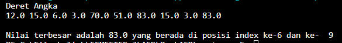

### Tugas No 4
Buatlah program untuk melakukan pencarian data penduduk berdasarkan NIK. Setiap penduduk mempunyai catatan data yang terdiri dari NIK, nama, alamat, dan jenis kelamin. Jumlah penduduk 
dan detail data penduduk diinputkan melalui keyboard. Kemudian data yang dicari juga diinputkan melalui keyboard

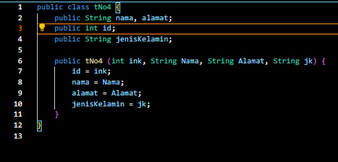
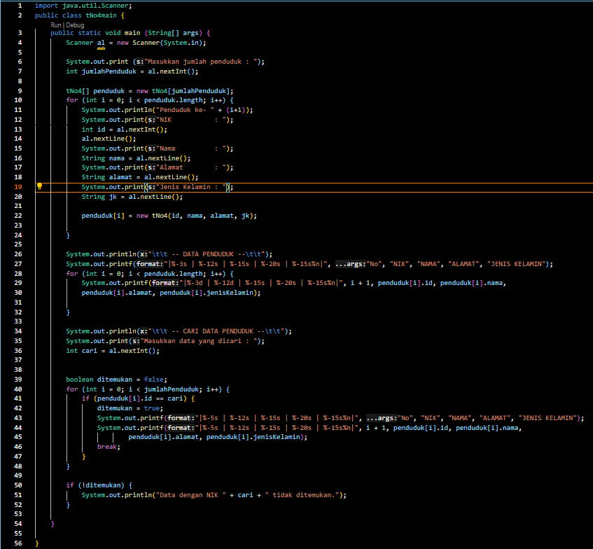
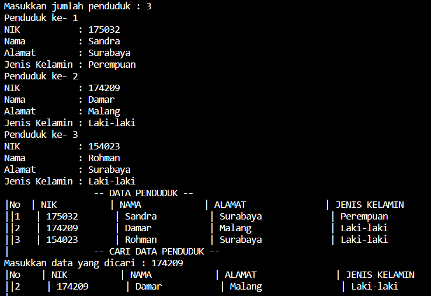
