# Laporan Praktikum Pertemuan 6
Nama    : Aldamaita Salwa Salsabila

Kelas   : SIB 2B

NIM     : 2241760050 / 05

## Kode dan Output 5.2
BUBBLE SORT
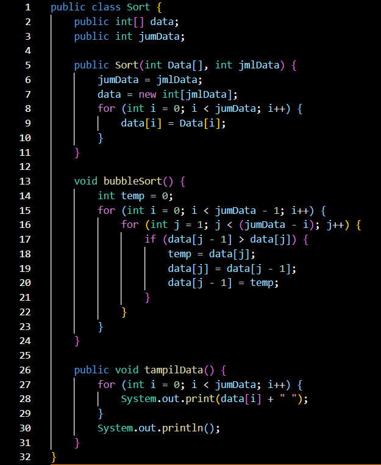
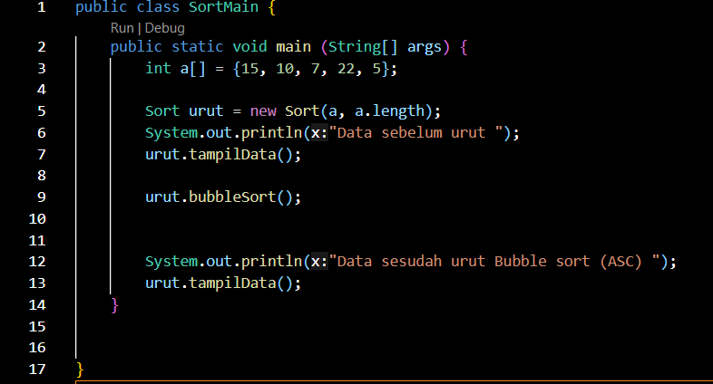
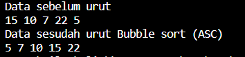

## -------------------------------

SELECTION SORT
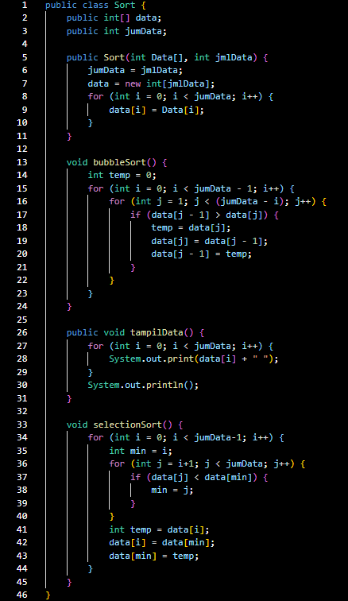
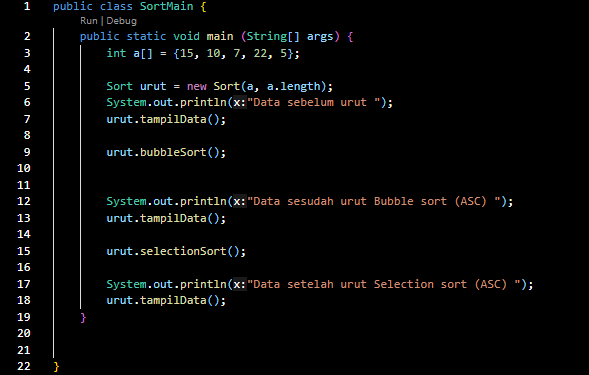
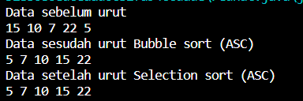

### Pertanyaan 5.2
1. Jelaskan maksud dari kode berikut
    
    BubbleSort urut = new BubbleSort(a, a.length);

Jawab :

Kode Sort urut = new Sort(a, a.length); digunakan untuk membuat objek dari kelas Sort dengan nama urut. Objek ini digunakan untuk mengoperasikan dan mengelola array data yang akan diurutkan menggunakan metode yang telah didefinisikan dalam kelas Sort, seperti pada bubbleSort. urut adalah objek yang memungkinkan untuk mengakses metode dan properti yang ada dalam kelas Sort, seperti mengurutkan data atau menampilkan data.

2. Jelaskan fungsi kode program berikut

temp = data[j];

data[j] = data[j - 1];

data[j - 1] = temp;

Jawab :

Kode ini digunakan untuk menukar dua elemen dalam array data jika elemen sebelumnya lebih besar daripada elemen saat ini. Ini adalah langkah kunci dalam algoritma Bubble Sort yang menggeser elemen-elemen yang lebih besar menuju akhir array, sehingga elemen terbesar berakhir di posisi paling kanan setelah satu iterasi.

4. Tunjukkan kode program yang merupakan algoritma pencarian nilai minimum pada selection sort!

Jawab :

for (int i = 0; i < jumData-1; i++) {
    int min = i;
    for (int j = i+1; j < jumData; j++) {
        if (data[j] < data[min]) {
         min = j;
        }
    }
    int temp = data[i];
    data[i] = data[min];
    data[min] = temp; 
}  

5. Kerjakan kembali program pengurutan menggunakan algoritma bublle sort dan SelectionSort di atas dengan pengurutan secara DESC!

Jawab :
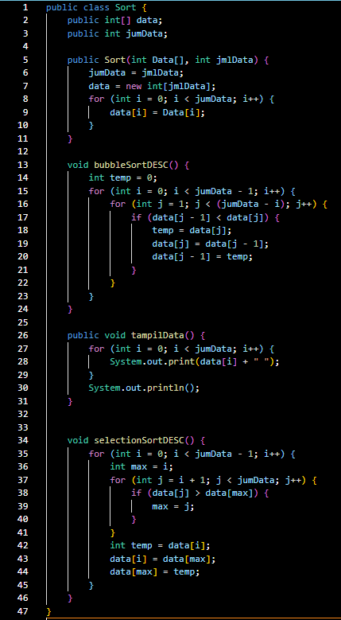
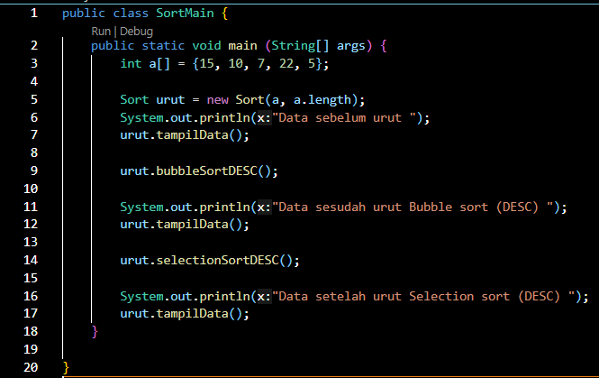
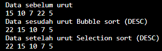

## Kode dan Output 5.3
BUBBLE SORT
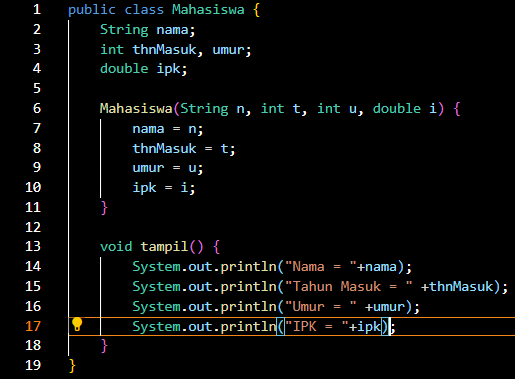
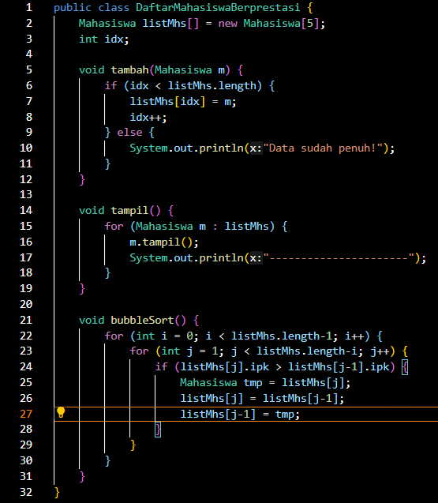

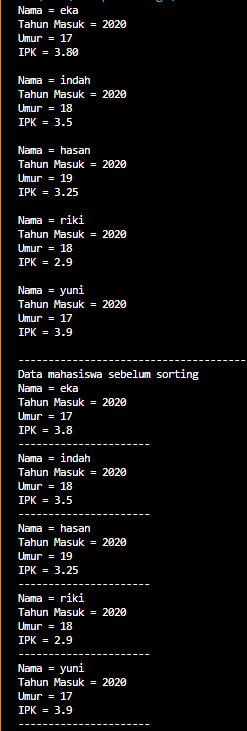
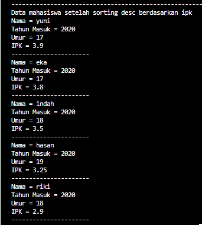

## -------------------------------

SELECTION SORT

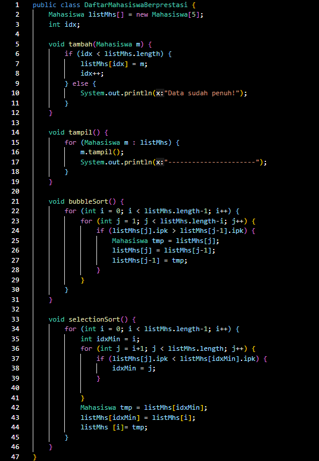
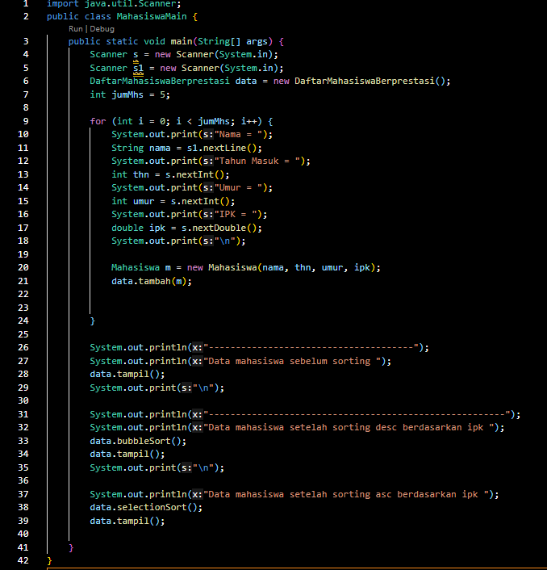

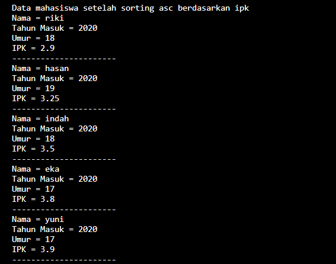

### Pertanyaan 5.3
1. Tunjukkan proses pencarian nilai minimum pada algoritma Selection Sort yang telah dipraktikkan pada pertemuan ini (bukti screen shoot kode program dan penjelasan)!

Jawab :

for (int i = 0; i < listMhs.length-1; i++) {
    int idxMin = i;
    for (int j = i+1; j < listMhs.length; j++) {
        if (listMhs[j].ipk < listMhs[idxMin].ipk) {
            idxMin = j;
        }
            
        Mahasiswa tmp = listMhs[idxMin];
        listMhs[idxMin] = listMhs[i];
        listMhs [i]= tmp;
    }
}

pada pemograman di atas dilakukan pencarian data, perulangan mengeksekusi jika tidak menemukan nilai minimum program akan terus mencari hingga menemukan nilai minimum tersebut

2. Jelaskan perbedaan proses swap yang terjadi pada Bubble Sort dengan Selection Sort!

Jawab :

Bubble Sort
- pertukaran dilakukan secara langsung
- setiap iterasi dua elemen berdekatan dibandingkan, dan jika elemen sebelah kanan lebih kecil dari elemen sebelah kiri , maka kedua elemen tersebut ditukar posisinya
- setiap iterasi memindahkan elemen terbesar ke ujung array(ascending), sehingga elemen terbesar akan muncul di posisi yang benar secara berurut

Selection Sort
- pertukaran elemen hanya dilakukan satu kali setelah proses pencarian elemen terkecil atau terbesar
- setiap iterasi, algoritma mencari elemen terkecil atau terbesar dalam sisa array yang belum diurutkan dan memindahkan elemen tersebut ke posisi yang benar

3. Di dalam method bubbleSort(), terdapat baris program seperti di bawah ini: 

if (listMhs[j].ipk > listMhs[j-1].ipk) {
    Mahasiswa tmp = listMhs[j];
    listMhs[j] = listMhs[j-1];
    listMhs[j-1] = tmp;
}

Jelaskan tujuan dari baris program tersebut

Jawab :

Tujuannya untuk mengurutkan elemen-elemen dalam array mahasiswa berdasarkan IPK mereka secara descending menggunakan algoritma Bubble Sort. Setiap iterasi algoritma ini akan memindahkan elemen dengan nilai IPK tertinggi ke ujung array (posisi yang benar dalam urutan yang diinginkan).

4. Perhatikan perulangan di dalam bubbleSort() di bawah ini:

    for (int i = 0; i < listMhs.length-1; i++) {
        for (int j = 1; j < listMhs.length-i; j++) {
        }
    }

a. Apakah perbedaan antara kegunaan perulangan i dan perulangan j? 

Jawab :

Perulangan i digunakan untuk mengontrol iterasi melalui elemen-elemen array secara keseluruhan, yang akan berkurang setiap kali proses iterasi luar (perulangan i) selesai. Ini mengatur jumlah iterasi total yang akan dilakukan oleh algoritma. Setiap iterasi luar (perulangan i) mewakili satu tahap dari algoritma Bubble Sort.

Perulangan j digunakan untuk mengontrol iterasi antara dua elemen yang sedang dibandingkan. Perulangan j akan berjalan dari indeks 1 hingga indeks listMhs.length - i. Ini mengatur perbandingan dan pertukaran antara elemen-elemen yang berdekatan selama setiap iterasi luar (perulangan i).

b. Mengapa syarat dari perulangan i adalah i<listMhs.length-1 ?

Jawab :

karena setiap iterasi luar (perulangan i) akan memindahkan elemen terbesar atau terkecil (tergantung pada urutan yang diinginkan) ke posisi yang benar di ujung array. Ketika elemen terbesar sudah berada di posisi terakhir, tidak perlu lagi melakukan perulangan tambahan. Oleh karena itu, kita hanya perlu melakukan perulangan hingga sebelum elemen terbesar mencapai posisi terakhir, yang terjadi pada listMhs.length - 1.

c. Mengapa syarat dari perulangan j adalah j<listMhs.length-i ?

Jawab :

karena pada setiap iterasi luar (perulangan i), elemen terbesar sudah berada di posisi paling akhir, sehingga kita tidak perlu lagi membandingkannya dengan elemen-elemen di sebelah kanannya. Dengan demikian, perulangan j hanya perlu membandingkan elemen-elemen yang belum terurut di sebelah kiri elemen terakhir yang sudah terurut.

d. Jika banyak data di dalam listMhs adalah 50, maka berapakali perulangan i akan berlangsung? Dan ada berapa Tahap bubble sort yang ditempuh?

Jawab :

Jika banyak data dalam listMhs adalah 50, maka perulangan i akan berlangsung sebanyak 49 kali. karena pada iterasi pertama, elemen terbesar akan berada di posisi terakhir, dan setiap iterasi selanjutnya akan mengurangi jumlah elemen yang perlu diurutkan.

5. Di dalam method selection sort, terdapat baris program seperti di bawah ini:

 int idxMin = i;
    for (int j = i+1; j < listMhs.length; j++) {
        if (listMhs[j].ipk < listMhs[idxMin].ipk) {
            idxMin = j;
        }
    }

Untuk apakah proses tersebut?

Jawab :

Proses dilakukan untuk mencari elemen terkecil dan kemudian menukar elemen terkecil tersebut dengan elemen pada posisi i. Dengan demikian, elemen terkecil akan dipindahkan ke posisi yang benar dalam array yang sudah terurut. Proses ini berulang untuk setiap iterasi luar Selection Sort sehingga elemen-elemen terurut dari kecil ke besar.

### Tugas
1. Disebuah sekolah akan melakukan seleksi anggota paskibraka berdasarkan tinggi badan siswa. Buatlah simulasi pengurutan yang tepat untuk membantu panitia memilih anggota paskibraka dengan pengurutan yang dilakukan adalah mulai dari siswa dengan tinggi badan paling tinggi ke rendah. Berikut ini merupakan ilustrasi class diagramnya. (NB: Semua atribut dibuat inputan).

Paskibraka

nama: String

kelas: String

tinggi: int
---------------------------------------
Paskibraka(a: String, b: String, c: int)

tampilIdentitas(): void

DaftarAnggotaPaskibraka

listPeserta: Paskibraka[10]

id: int
---------------------------------------
tambah(m: Paskibraka): void

tampil(): void

Sorting(): void

Jawab :

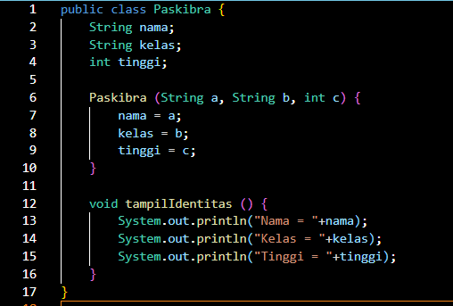
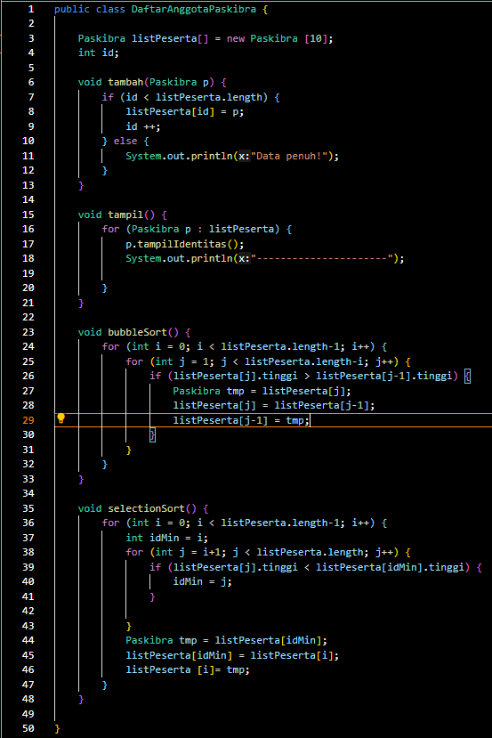
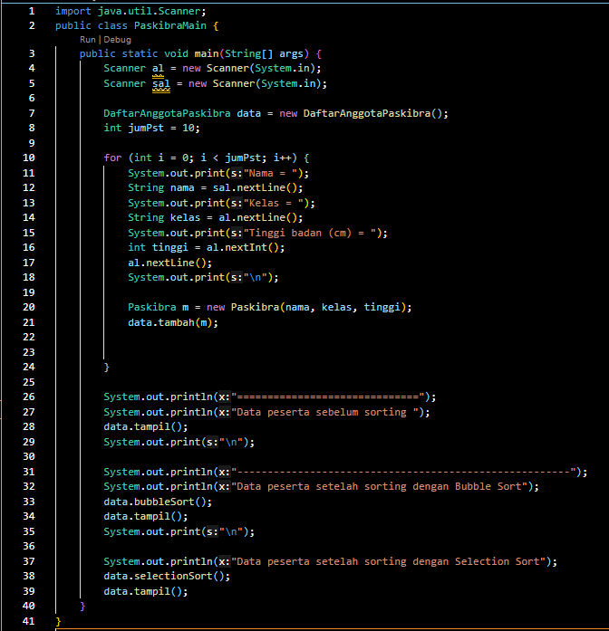
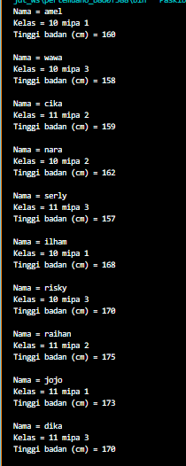  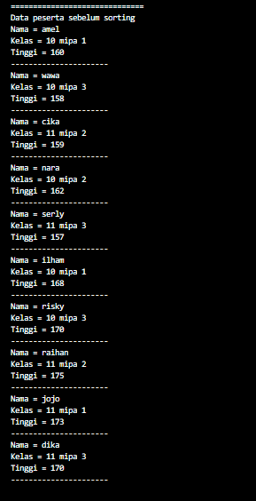
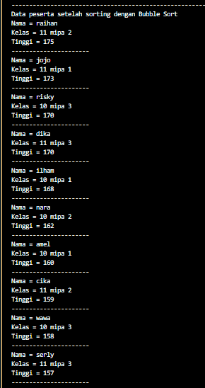  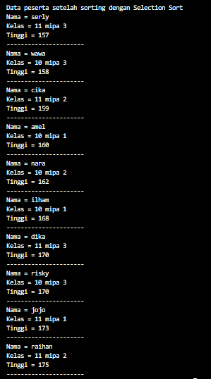

2. Berdasarkan soal no 1, modifikasilah agar program dapat menyeleksi tinggi badan siswa yang diterima sebagai anggota paskibraka dengan ketentuan siswa yang lolos seleksi adalah tinggi badannya minimal 170 cm.

Jawab :

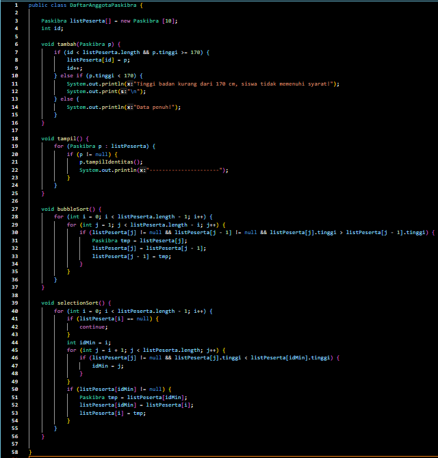

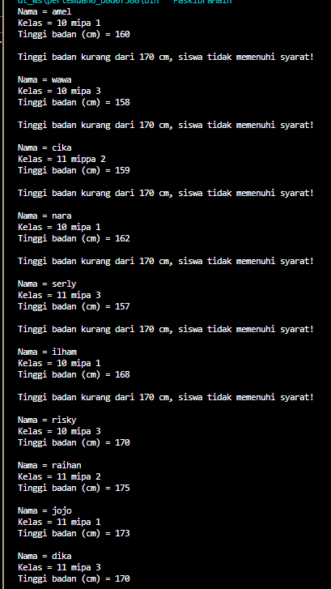  
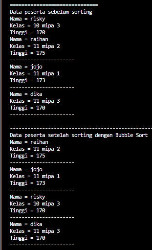
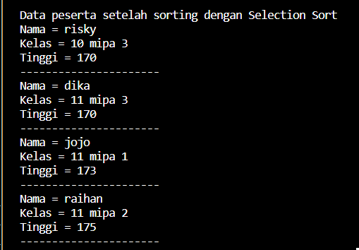

3. Seorang pustakawan hendak mengurutkan buku di dalam almari secara berurutan dari terpendek-tertipis hingga tertinggi-tertebal secara vertikal (berdiri). Buat simulasi pengurutan yang dilakukan oleh pustakawan tersebut dengan mengacu data pada tabel, aturan pengurutan berdasarkan metode program, dan class 
diagram berikut!

Judul Buku                  Jumlah Halaman      Ukuran Buku
Algoritma pemrograman           1292                B5
Basis data                      400                 A4
Dasar Pemrograman               294                 B3
Rekayasa Perangkat              824                 B2 
Lunak                

Dengan ketentuan sebagai berikut:

a. Buatlah class Buku, PengurutanBuku, dan Main.
b. Di dalam class PengurutanBuku, buat method pengurutan ascending berdasar UkuranBuku menggunakan bubble sort dan buat method pengurutan ascending berdasar Jumlah Halaman menggunakan selection sort
c. Ukuran buku harus melalui konversi tinggi buku yang dimaksud dalam satuan ukuran, contoh A4: 21,0 x 29,7 cm sehingga nilai tinggi buku yang terpakai adalah 29,7

Jawab :

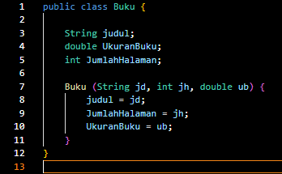
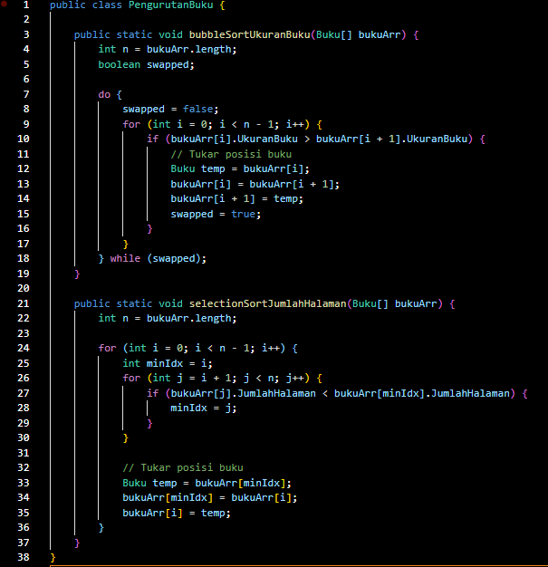
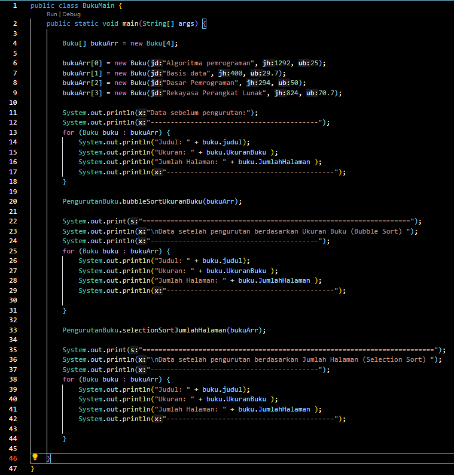
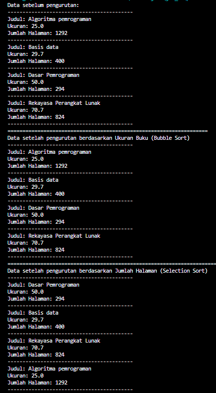  

