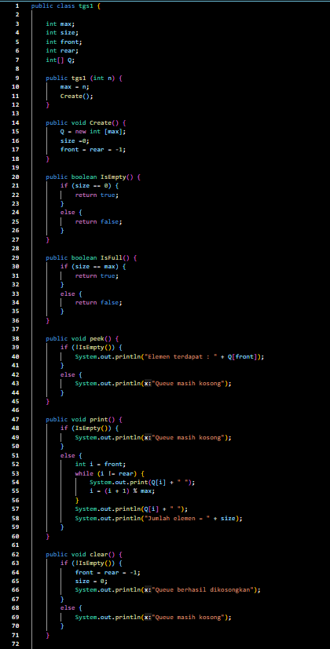
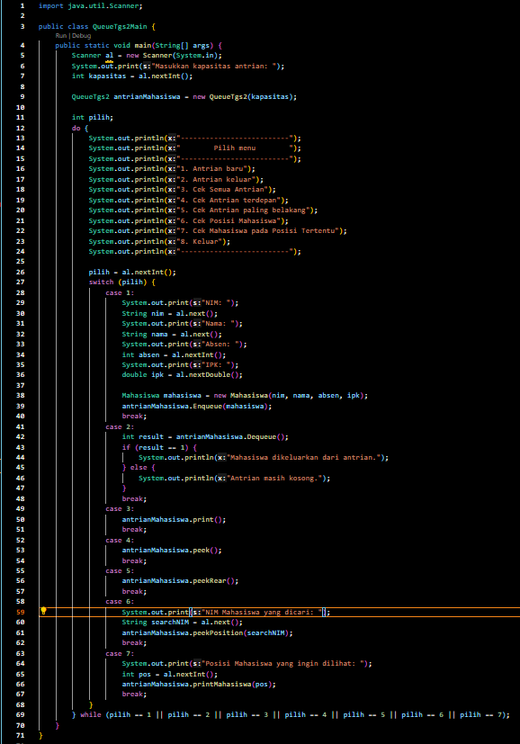

# Laporan Praktikum Pertemuan 7
Nama    : Aldamaita Salwa Salsabila

Kelas   : SIB 2B

NIM     : 2241760050

# PRAKTIKUM STACK DAN QUEUE

## Program dan Output 7.2

### Pertanyaan 7.2
1. Pada method Create, mengapa atribut front dan rear diinisialisasi dengan nilai -1, tidak 0?

Jawab :

hal ini dilakukan untuk membedakan antara antrian yang kosong dengan antrian penuh. nilai -1 digunakan sebagai penanda untuk mengidentifikasi bahwa antrian saat tidak berisi elemen apa pun. jika menginisialisasikan front dan rear dengan 0, maka mungkin akan menjadi lebih sulit membedakan antara antrian yang kosong dan antrian yang berisi satu elemen.

2. Pada method Enqueue, jelaskan maksud dan kegunaan dari potongan kode berikut!

if (rear == max -1) {
    rear = 0;
}

Jawab :

kode tersebut digunakan untuk mengatur ulang rear saat antrian sudah mencapai kapasitas maksimum dan elemen terakhir sudah diisi.

3. Perhatikan kembali method Enqueue, baris kode program manakah yang menunjukkan bahwa data baru disimpan pada posisi terakhir di dalam queue?

Jawab :

Q[rear] = data;

4. Perhatikan kembali method Dequeue, baris kode program manakah yang menunjukkan bahwa data yang dikeluarkan adalah data pada posisi paling depan di dalam queue?

Jawab :

data = Q[front];

5. Pada method Dequeue, jelaskan maksud dan kegunaan dari potongan kode berikut!

if (rear == max -1) {
    rear = 0;
}

Jawab : 

kode tersebut digunakan untuk mengatasi situasi di mana rear sudah mencapai batas akhir dari array antrian atau digunakan untuk mengatasi situasi saat antrian hampir kosong dan menjaga agar antrian beroperasi dalam mode lingkaran.

6. Pada method print, mengapa pada proses perulangan variabel i tidak dimulai dari 0 (int i=0), melainkan int i=front?

Jawab :

hal ini disebabkan ketika front dimulai dan melakukan perulangan hingga rear, akan memastikan bahwa elemen-elemen antrian dicetak dalam ururtan yang benar sesuai dengan urutan aslinya dalam antrian.

7. Perhatikan kembali method print, jelaskan maksud dari potongan kode berikut!

i = (i + 1) % max;

Jawab:

kode tersebut digunakan untuk menggeser nilai indeks i saat mencetak elemen-elemen antrian dalam implementasi berbasis array dan menghindari perpindahan indeks di luar batas array.

## Program dan Output 7.2

### Pertanyaan 7.3
1. Perhatikan class Queue, apa fungsi kode program berikut pada method Dequeue?

Penumpang data = new Penumpang("", "", 0, 0);

Jawab :

kode tersebut digunakan untuk menginisialisasikan objeck data sebagai objeck penumpang dengan mengembalikan nilai-nilai default yang digunakan jika antrian kosong.

2. Pada soal nomor 1, apabila kode program tersebut diganti dengan kode berikut:
Penumpang data = new Penumpang()
Apakah yang terjadi? Mengapa demikian?

Jawab :

akan terjadi eror, karena pada class Penumpang tidak memiliki konstruktor tanpa argumen yang telah didefinisikan di dalamnya.

3. Tunjukkan kode program yang digunakan untuk menampilkan data yang dikeluarkan dari queue!

Jawab :

4. Lakukan modifikasi program dengan menambahkan method baru bernama peekRear pada class Queue yang digunakan untuk mengecek antrian yang berada di posisi belakang! Tambahkan pula daftar menu 5. Cek Antrian paling belakang pada class QueueMain sehingga method peekRear dapat dipanggil

Jawab :

## Tugas
1. Tambahkan dua method berikut ke dalam class Queue pada Praktikum1:
    a. Method peekPosition(data: int) : void 
    Untuk menampilkan posisi dari sebuah data di dalam queue, misalnya dengan mengirimkan data tertentu, akan diketahui posisi (indeks) data tersebut berada di urutan keberapa
    b. Method peekAt(position: int) : void
    Untuk menampilkan data yang berada pada posisi (indeks) tertentu
Sesuaikan daftar menu yang terdapat pada class QueueMain sehingga kedua method tersebut dapat dipanggil!

Jawab :

  

2. Buatlah program antrian untuk mengilustasikan mahasiswa yang sedang meminta tanda tangan KRS pada dosen DPA di kampus. Ketika seorang mahasiswa akan mengantri, maka dia harus menuliskan terlebih dulu NIM, nama, absen, dan IPK seperti yang digambarkan pada Class diagram berikut:

Mahasiswa
nim: String
nama: String
absen: int
ipk: double

Mahasiswa(nim: String, nama: String, absen: int, ipk: double)

Class diagram Queue digambarkan sebagai berikut:

Queue
max: int
front: int
rear: int
size: int
antrian: Mahasiswa[]

Queue(max: int)
create(): void
isEmpty(): boolean
isFull(): boolean
enqueue(antrian: Mahasiswa): void
dequeue(): int
print(): void
peek(): void
peekRear(): void
peekPosition(nim: String): void
printMahasiswa(posisi: int): void

Catatan:

• Method create(), isEmpty(), isFull(), enqueue(), dequeue() dan print(), kegunaannya sama seperti yang telah dibuat pada Praktikum

• Method peek(): digunakan untuk menampilkan data Mahasiswa yang berada di posisi antrian paling depan

• Method peekRear(): digunakan untuk menampilkan data Mahasiswa yang berada di posisi antrian paling belakang

• Method peekPosition(): digunakan untuk menampilkan posisi antrian ke berapa, seorang Mahasiswa berada Pengecekan dilakukan berdasarkan NIM

• Method printMahasiswa(): digunakan untuk menampilkan data mahasiswa pada suatu posisi tertentu dalam antrian

Jawab :

 

  

