# Laporan Praktikum Pertemuan 7
Nama    : Aldamaita Salwa Salsabila

Kelas   : SIB 2B

NIM     : 2241760050

# PRAKTIKUM STACK

## Program dan Output 7.2
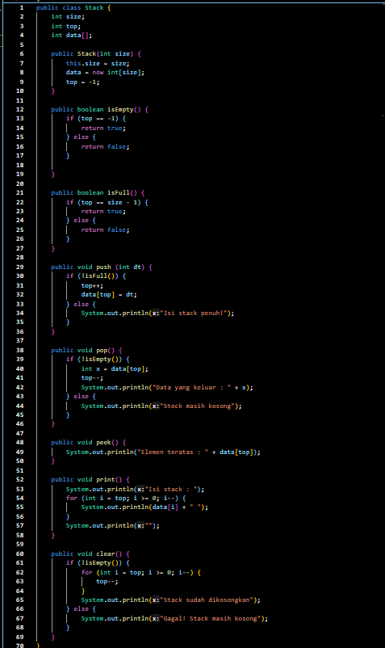
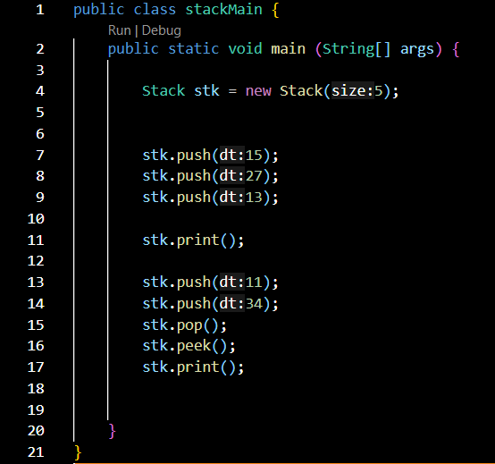
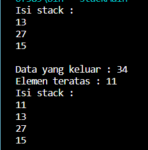

### Pertanyaan 7.2
1. Perhatikan class StackMain, apakah fungsi angka 5 pada potongan kode program berikut?

Jawab :

Angka 5 tersebut dugunakan untuk argumen yang diberikan pada konstruktor class Stack, atau bisa disebut parameter yang menentukan ukuran stack yang akan dibuat.

2. Lakukan penambahan data ke stack sebanyak dua kali, menggunakan angka 18 dan 40. Tampilkan hasilnya!

Jawab :

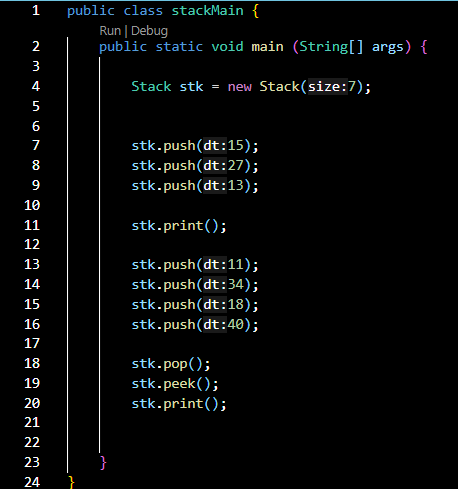
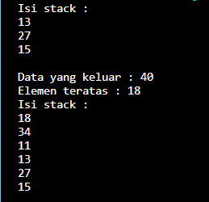

3. Pada soal nomor 2, mengapa data yang dimasukkan ke dalam Stack hanya angka 18, sedangkan angka 40 tidak dimasukkan? Jelaskan!

Jawab :

karena nilai 40 dikeluarkan dan nilai 40 adalah nilai yang paling atas, sehingga ketika di pop nilai 40 dikeluarkan dan tidak dimasukkan.

## Program dan Output 7.3
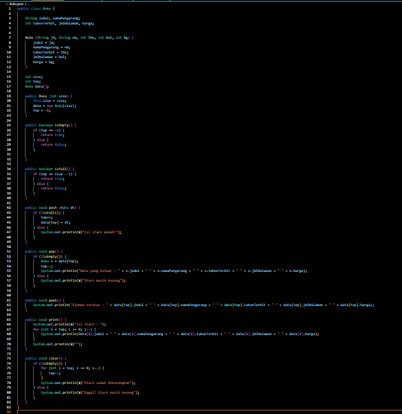
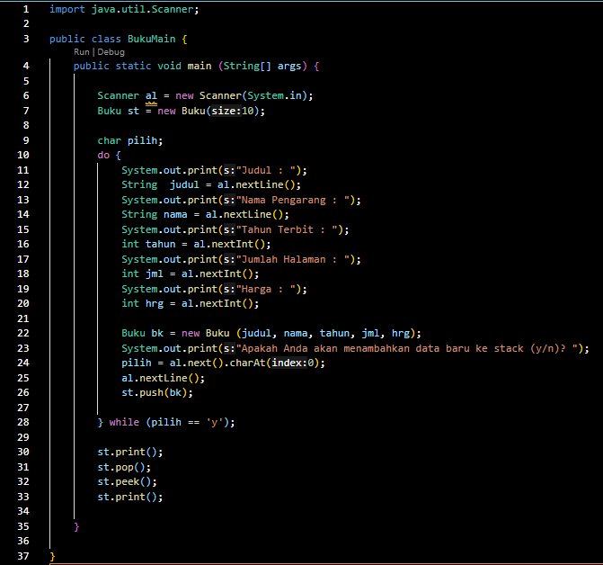
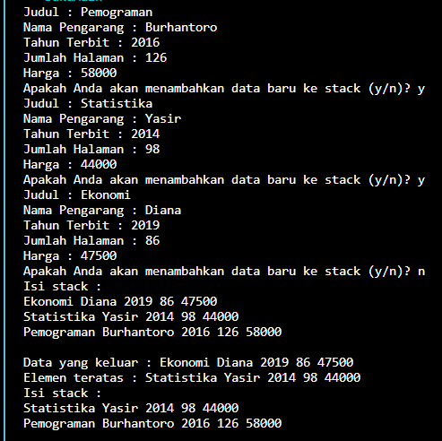

### Pertanyaan 7.3
1. Perhatikan class StackMain, pada saat memanggil fungsi push, parameter yang dikirimkan adalah bk. Data apa yang tersimpan pada variabel bk tersebut?

Jawab :

data yang tersimpan yaitu informasiyang telah dimasukkan atau yang diinputkan di dalam do-while, seperti judul buku, nama pengarang, tahun terbit, jumlah halaman, dan harga.

2. Tunjukkan potongan kode program untuk menentukan kapasitas penampungan stack!

Jawab :

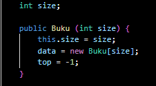

3. Apakah fungsi penggunaan do-while yang terdapat pada class StackMain?

Jawab :

untuk memasukkan detail buku ke dalam stack secara berulang sesuai kebutuhan.

4. Modifikasi kode program pada class StackMain sehingga pengguna dapat memilih operasi-operasi pada stack (push, pop, peek, atau print) melalui pilihan menu program.

Jawab :

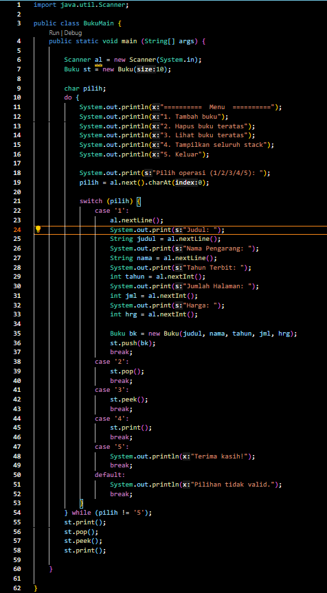
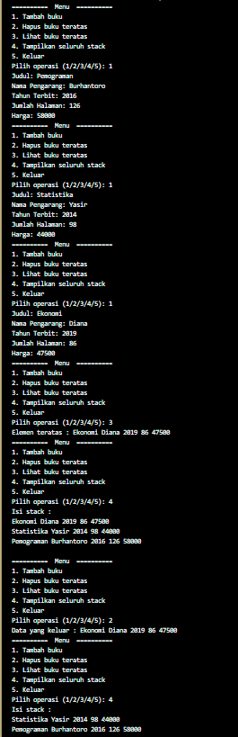

## Program dan Output 7.4
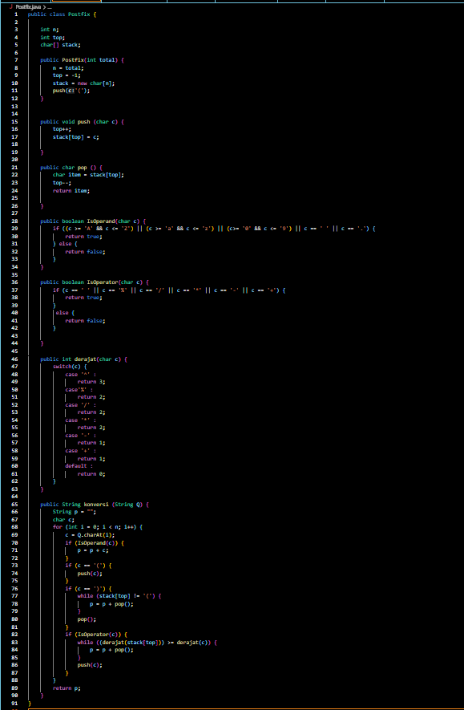
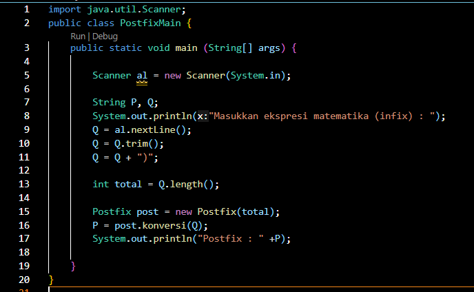
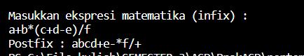

### Pertanyaan 7.4
1. Perhatikan class Postfix, jelaskan alur kerja method derajat!

Jawab :

a. method derajat menerima parameter c yang merupakan operator matematika
b. terdapat blok switch yang memeriksa nilai c, setiap operatornya memiliki prioritas atau level yang berbeda
   
    '^' (pangkat) memiliki derajat prioritas 3.

    '%', '/', dan '*' memiliki derajat prioritas 2.

    '-' dan '+' memiliki derajat prioritas 1.

    Operator lainnya memiliki derajat prioritas 0

b. setelah memeriksa nilai c, method derajat akan mengembalikan nilai derajat prioritas yang sesuai berdasarkan operator.

2. Apa fungsi kode program berikut?

c = Q.charAt(i);

Jawab :

berfungsi untuk mengambil karakter pada posisi 'i' dan string 'q', menampilkan dalam variabel 'c'. Pada method konversi ini digunakan untuk konteks konversi ekspresi dari notasi infix menjadi postfix.

3. Jalankan kembali program tersebut, masukkan ekspresi 3*5^(8-6)%3. Tampilkan hasilnya!

Jawab :
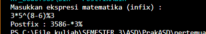

4. Pada soal nomor 2, mengapa tanda kurung tidak ditampilkan pada hasil konversi? Jelaskan!

Jawab :

karena dalam algoritma konversi ekspresi ke notasi postfix, tanda kurung digunakan untuk mengatur urutan operasi dalam stack dan tidak dimasukkan ke postfix.

### Tugas
1. Buat program dengan menggunakan konsep Stack untuk memasukkan sebuah kalimat, kemudian keluaran yang ditampilkan berupa kalimat dengan urutan karakter terbalik!

Masuk kalimat : Politeknik Negeri Malang
Hasil :
gnalaM iregeN kinketiloP

Jawab :

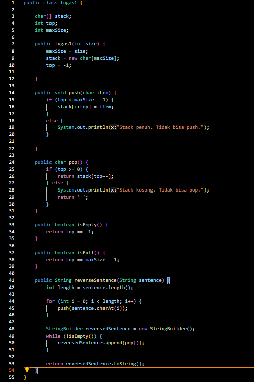
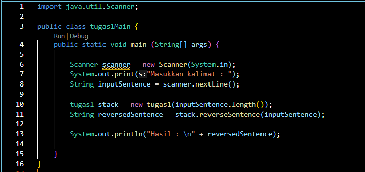
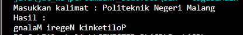

2. Setiap hari Minggu, Dewi pergi berbelanja ke salah satu supermarket yang berada di area rumahnya. Setiap kali selesai berbelanja, Dewi menyimpan struk belanjaannya di dalam laci. Setelah dua bulan, ternyata Dewi sudah mempunyai delapan struk belanja. Dewi berencana mengambil lima struk belanja untuk ditukarkan dengan voucher belanja.
Buat sebuah program stack untuk menyimpan data struk belanja Dewi, kemudian lakukan juga proses pengambilan data struk belanja. Informasi yang tersimpan pada struk belanja terdiri dari:

• Nomor transaksi

• Tanggal pembelian

• Jumlah barang yang dibeli

• Total harga baya

Jawab :
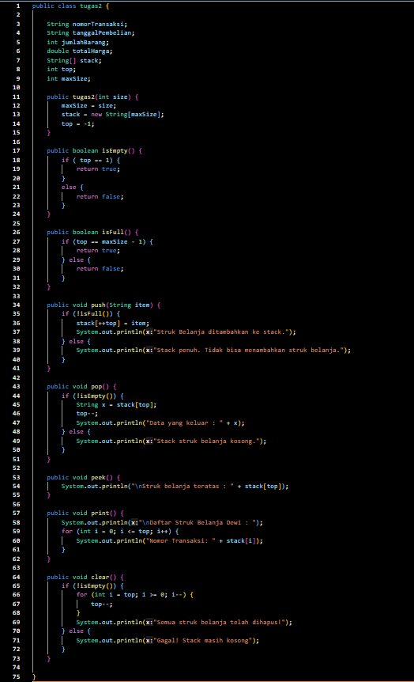
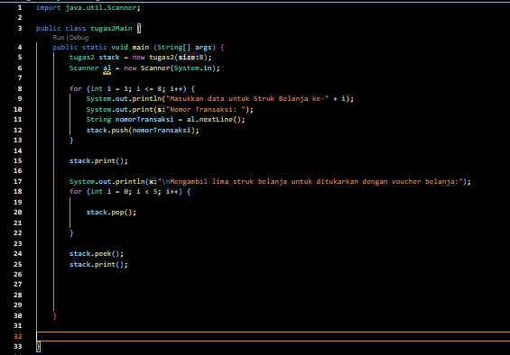
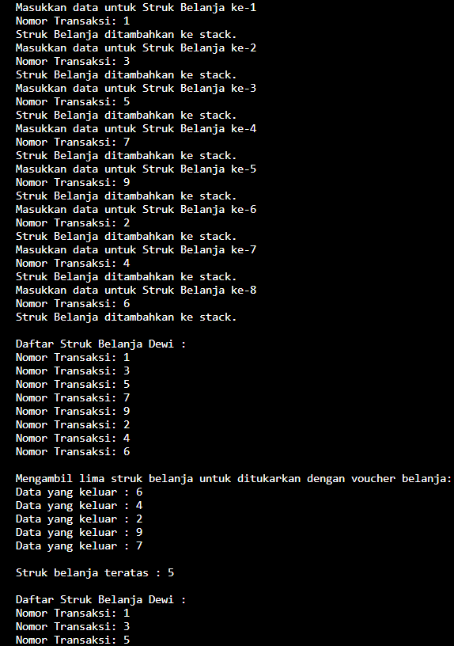

