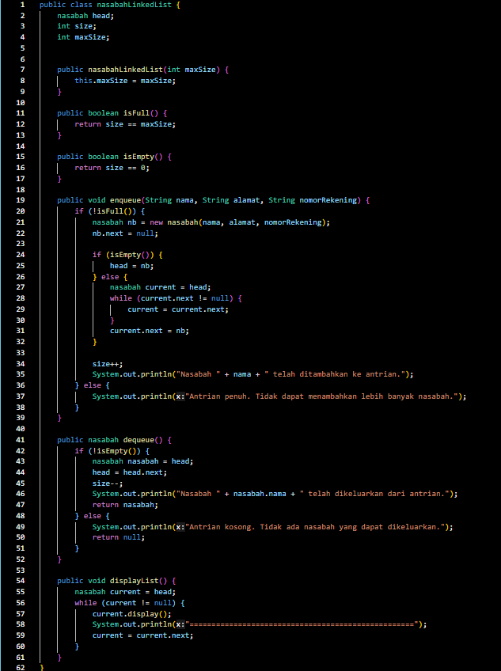

# Laporan Praktikum Pertemuan 8

Nama    : Aldamiata Salwa Salsabila

Kelas   : SIB 2B

NIM     : 2241760050

## Program dan Output 9.2

### Pertanyaan 9.2
1. Mengapa hasil compile kode program di baris pertama menghasilkan “Linked List Kosong”?

Jawab :

Karena pada method print dipanggil sebelum ada elemen yang ditambahkan ke dalam linked list, sehingga menunjukkan linked list kosong.

2. Pada step 10, jelaskan kegunaan kode berikut

ndInput.next = temp.next;
temp.next = ndInput:

Jawab :

Kode tersebut digunakan untuk memasukkan node ndIndput ke dalam sebuah linked list. untuk temp sementara digunakan untuk mengakses node saat dalam linked list.

3. Perhatikan class SingleLinkedList, pada method insertAt Jelaskan kegunaan kode berikut

if(temp.next.next == null) tail = temp.next;

Jawab :

Kode tersebut digunakan untuk mengatur tail dari linked list jika kondisinya memenuhi.

## Program dan Output 9.3

### Pertanyaan 9.3
1. Mengapa digunakan keyword break pada fungsi remove? Jelaskan!

Jawab :

Break digunakan untuk menghentikan iterasi melalui linked list setelah operasi penghapus dilakukan.

2. Jelaskan kegunaan kode dibawah pada method remove

else if (temp.next.data == key) 
    temp.next = temp.next.next;

Jawab :

Kode diatas digunakan untuk menghapus elemeb(node) dalam struktur data berantai (linked list) berdasarkan nilai kunci(key).

3. Apa saja nilai kembalian yang dapat dikembalikan pada method indexOf? Jelaskan maksud masing-masing kembalian tersebut!

Jawab :

Pada method indexOf terdapat dua kemungkinan. Jika mengembalikan -1, elemn dengan nilai key tidak ada dalam linked list. Jika mengembalikan bukan negatif, elemen nilai key ditemukan pada posisi atau indeks tersebut dalam linked list.

## Tugas
1. Buat method insertBefore untuk menambahkan node sebelum keyword yang diinginkan

Jawab :

2. Implementasikan ilustrasi Linked List Berikut. Gunakan 4 macam penambahan data yang telah dipelajari sebelumnya untuk menginputkan data.

Jawab :

3 Buatlah Implementasi Stack berikut menggunakan Linked List

Jawab :

4. Buatlah implementasi program Nasabah Bank menggunakan LinkedList dengan data berupa 

nama, alamat dan nomor rekening nasabah

Jawab :

5. Implementasikan Queue pada antrian Nasabah pada nomor 4 dengan menggunakan konsep LinkedList!

Jawab :

